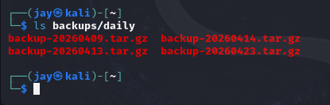
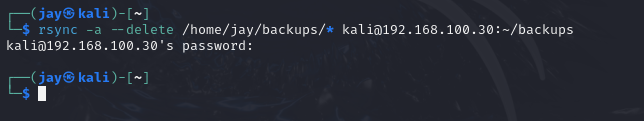
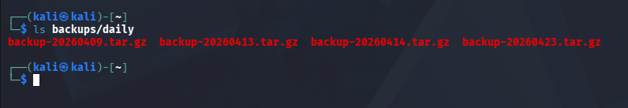
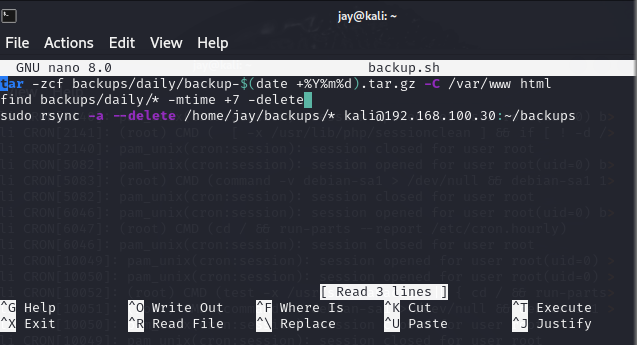
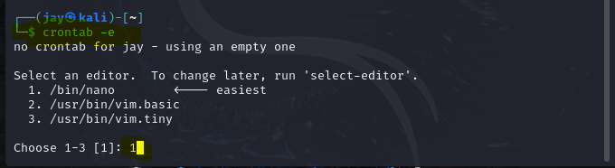
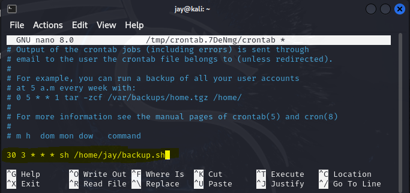

# Backup using Rsync and Cron

## Summary

Lean how to use rsync, tar, and cron to setup a daily backup on Linux. In this tutorial, we will backup a website, but this script can be modified to backup any directory or files.

## Pre-requisite

- Passwordless SSH should already be set up. You can visit the sample documentation [here](https://github.com/csarmiento17/Cybersecurity-Projects/tree/master/Setup-Passwordless-SSH) on how to do it

## tar

- By using this command, you create a point-in-time snapshot of your web directory.

`tar -zcf backups/daily/backup-$(date +%Y%m%d).tar.gz -C /var/www html`

| Flag | Description                        |
| ---- | ---------------------------------- |
| c    | create a new archive               |
| f    | use archive file or device ARCHIVE |
| v    | verbosely list files processed     |
| x    | extract files from an archive      |
| z    | filter the archive through gzip    |
| C    | change to directory DIR            |
|      |                                    |

## Delete backups older than 7 days

- The below script used to maintain a 7-day rolling window of daily backups. It ensures that on day 8, the backup from day 1 is deleted to make room for the new one.

`find backups/daily/* -mtime +7 -delete`

## Rsync

- Create a directory (e.g. backup) in the destination server

| Flag   | Description                                                          |
| ------ | -------------------------------------------------------------------- |
| delete | used to keep a destination directory in perfect sync with the source |
| a      | archive mode                                                         |
|        |                                                                      |

`rsync -a --delete /home/jay/backups/* kali@192.168.100.30:~/backups`

Verify that the file was copied to destination

- Create a shell script (backup.sh) and put all the 3 commands we used

## Cron

- Background service (daemon) used to schedule and automate repetitive tasks at specific times or intervals

| Name         | Description                      | Range                    |
| ------------ | -------------------------------- | ------------------------ |
| Minute       | Minute of the hour               | 0 - 59                   |
| Hour         | Hour of the day (24-hour format) | 0 - 23                   |
| Day of Month | Specific day of the month        | 1 - 31                   |
| Month        | Specific month                   | 1 - 12 (or Jan-Dec)      |
| Day of Week  | Specific day of the week         | 0 - 7 (0 or 7 is Sunday) |
|              |                                  |

- Modify _crontab_ and add the _backup.sh_ script we previously created

- The below script will run 3:30AM every day

