# Device Collection - Query Rule

A Query Rule in MECM (Microsoft Endpoint Configuration Manager, formerly SCCM) is a dynamic rule used to populate collections.

### Create Device Collections for All Windows 10 Devicesconfiguration

Go to _Assets and Compliance_ > right click _Device Collection_ > _Create Device Collection_

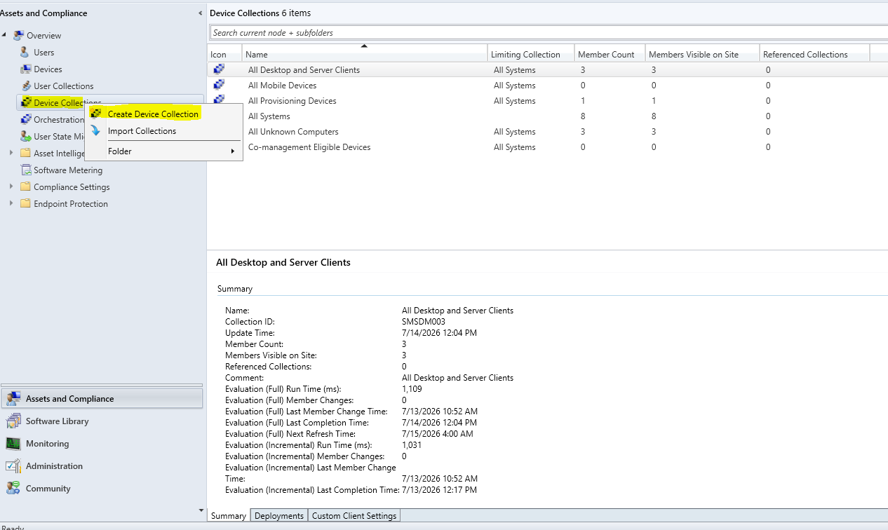

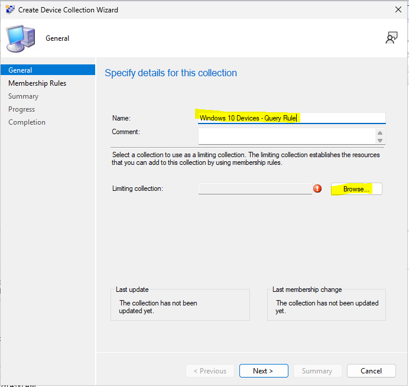

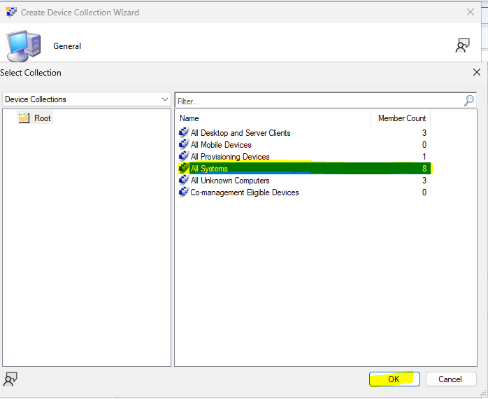

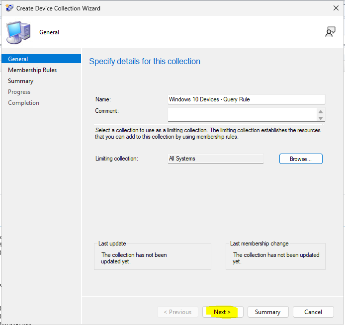

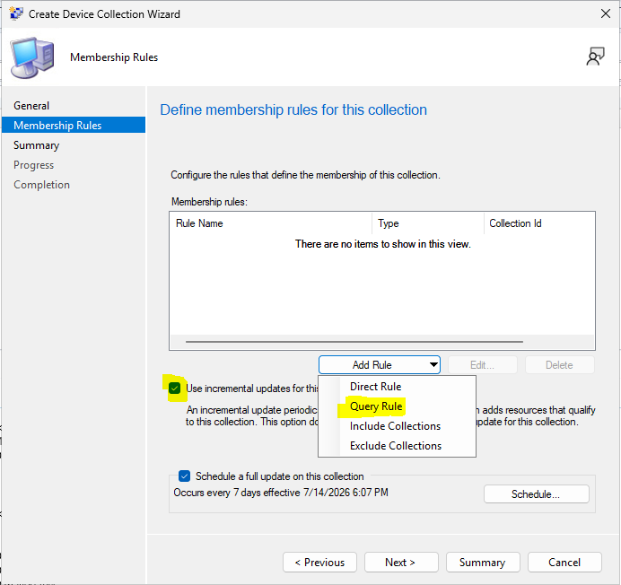

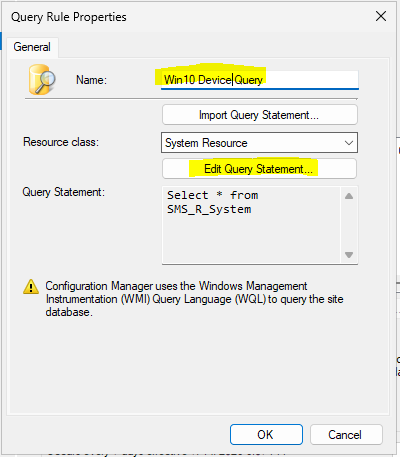

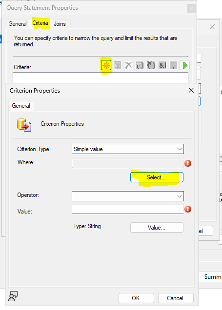

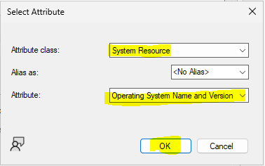

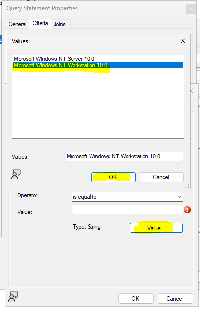

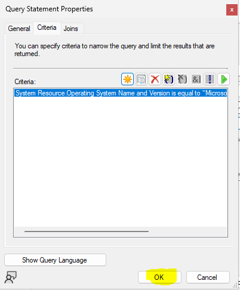

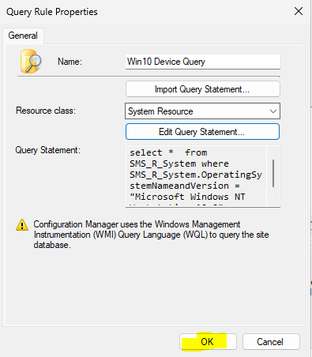

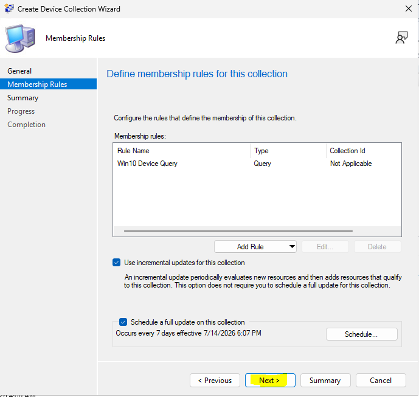

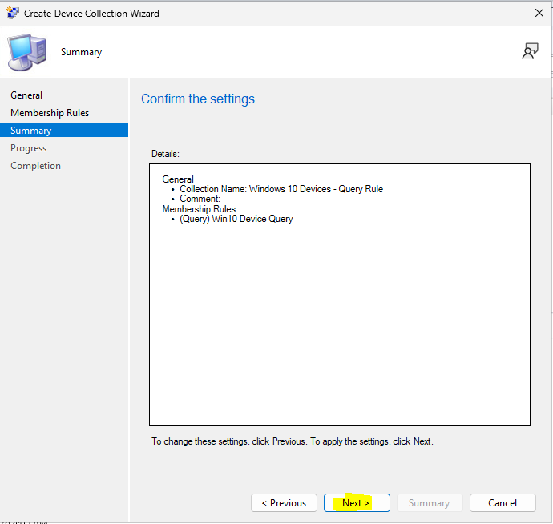

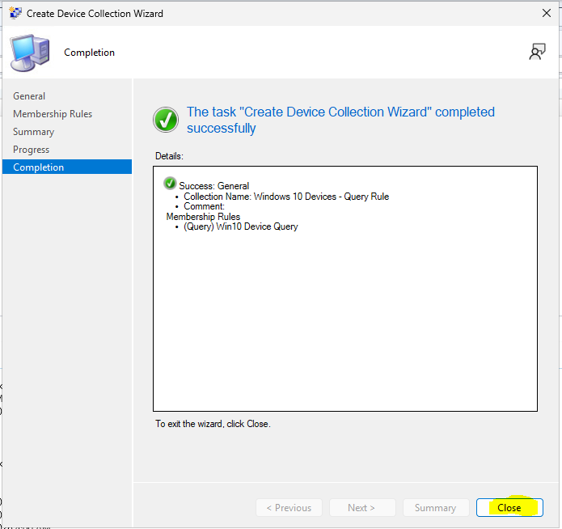

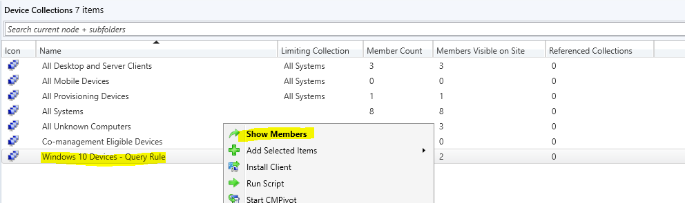

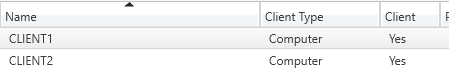
