# User Collection - Direct Rule

A Direct Rule in MECM (Microsoft Endpoint Configuration Manager, formerly SCCM) is a static method used to manually assign specific users to a collection.

### Direct Rule configuration

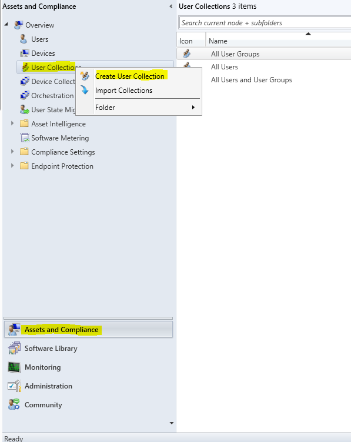

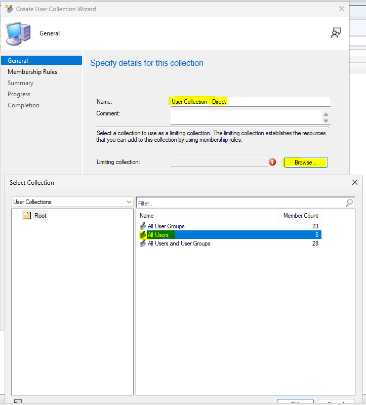

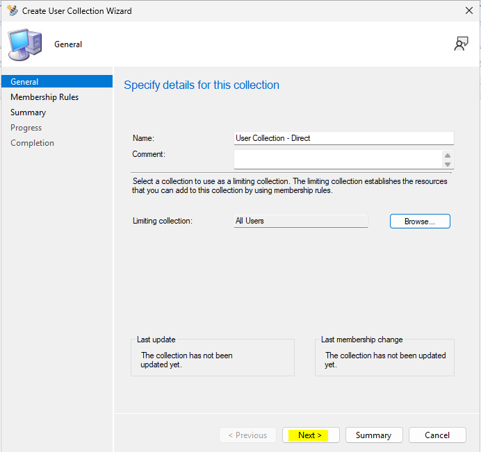

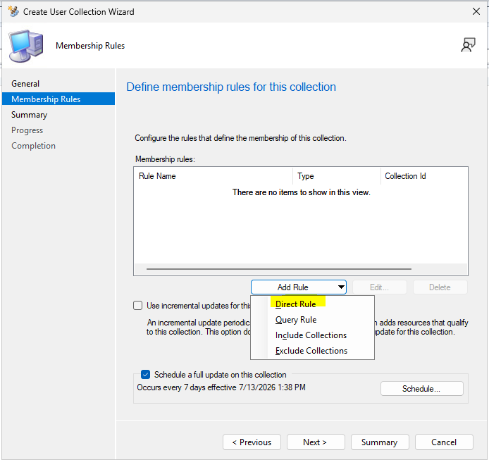

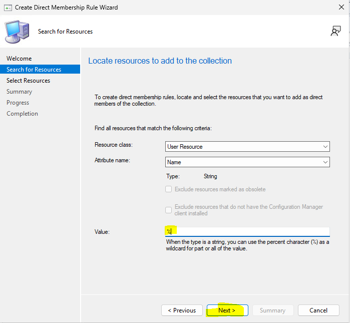

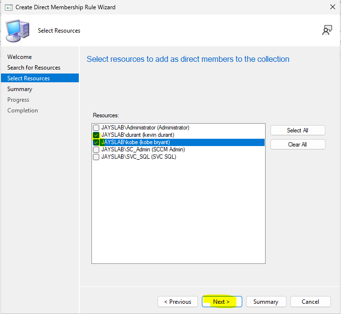

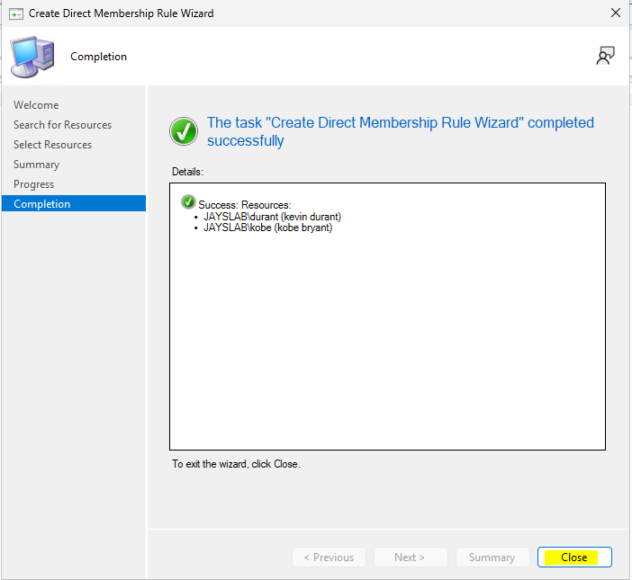

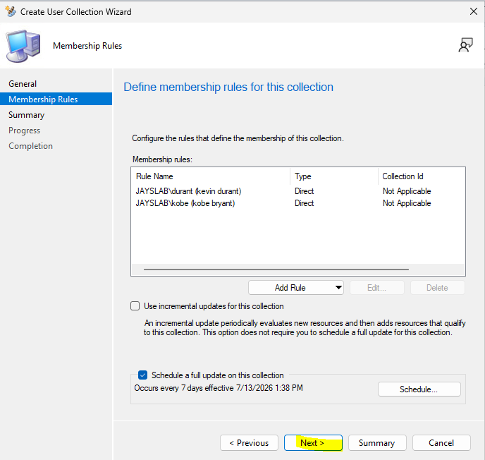

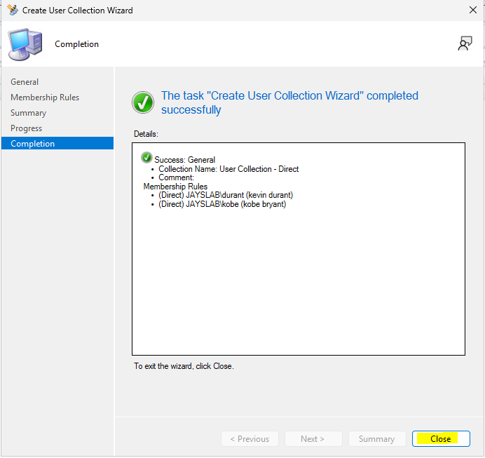

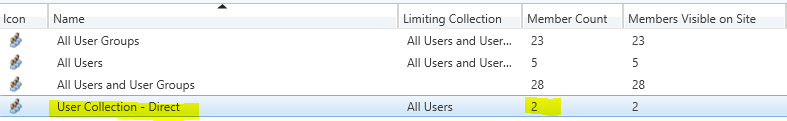

Right click the newly created User Collection and choose *Show Members*

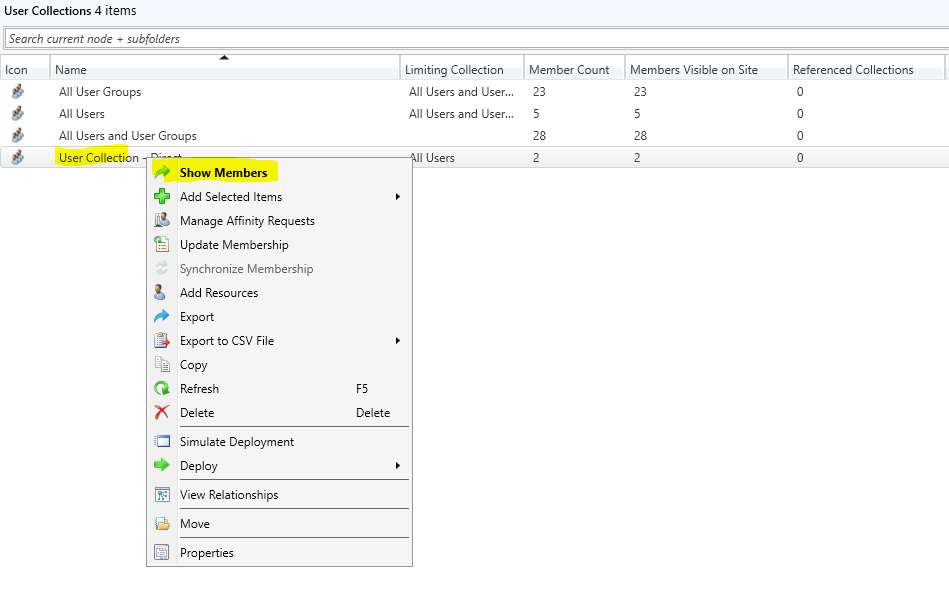

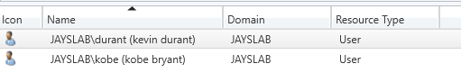

