# User Collection - Query Rule

A Query Rule in MECM (Microsoft Endpoint Configuration Manager, formerly SCCM) is a dynamic rule used to populate collections.

### Query Rule configuration

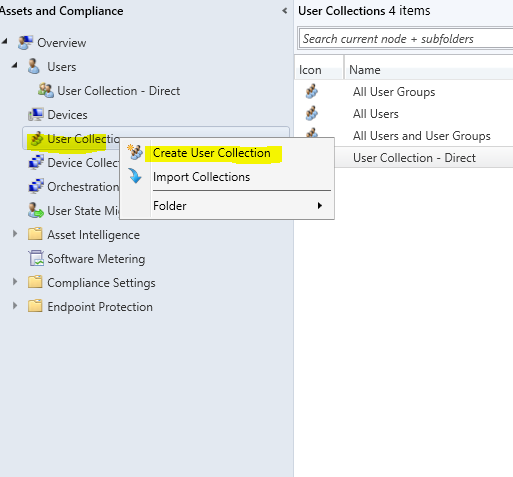
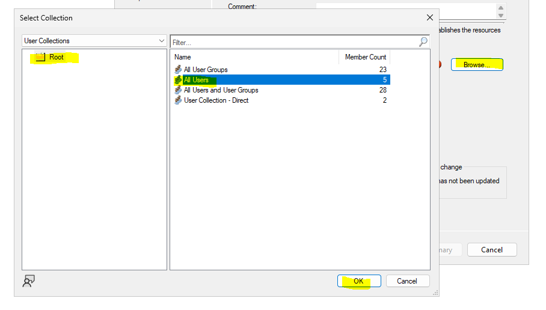
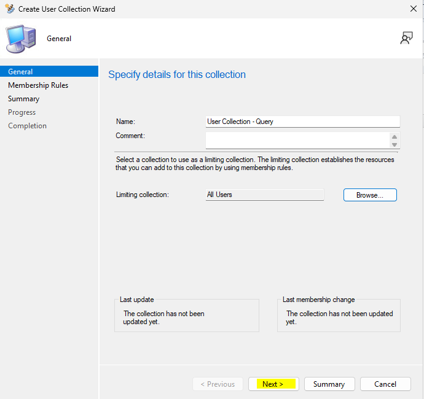
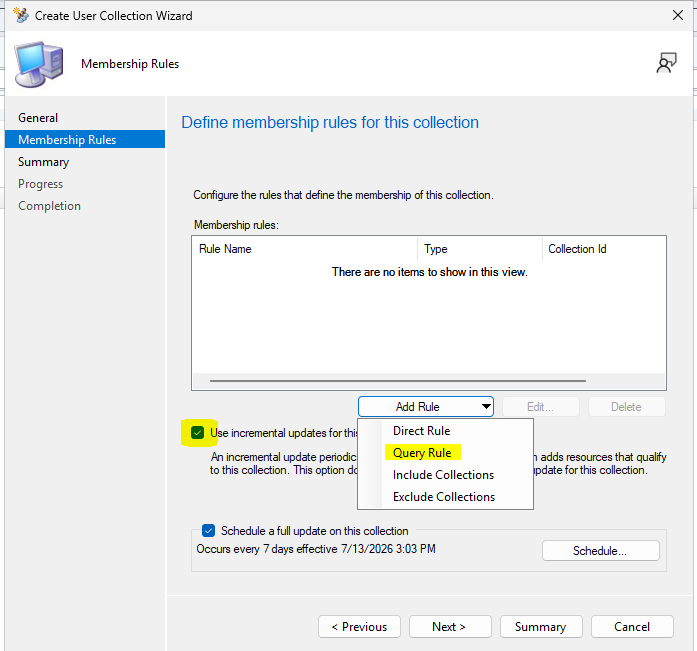
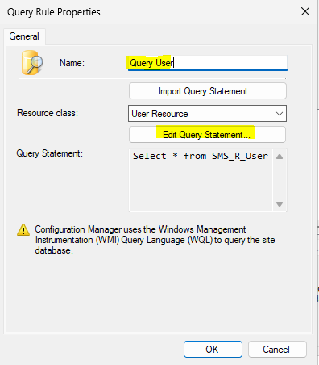

Go to _Criteria Tab_ and click the _yellow icon_

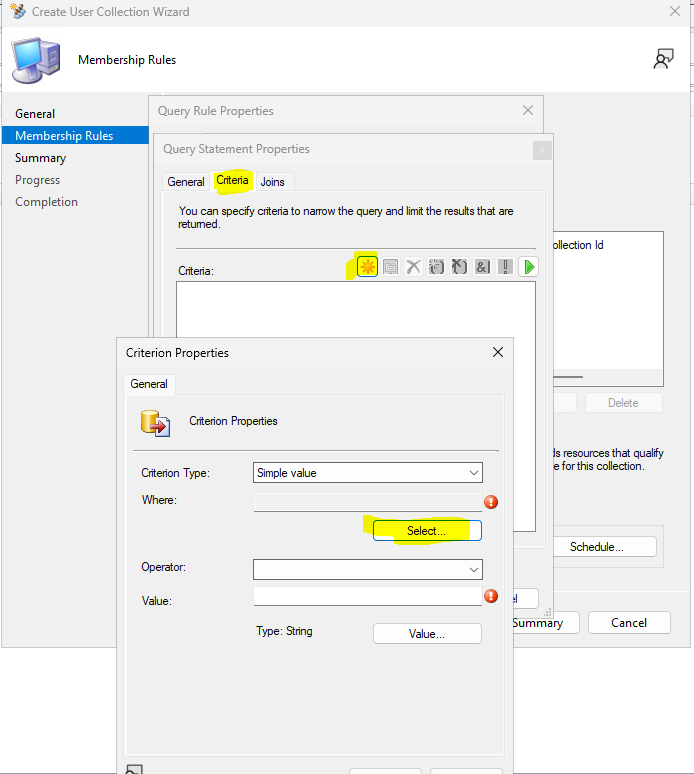
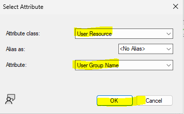
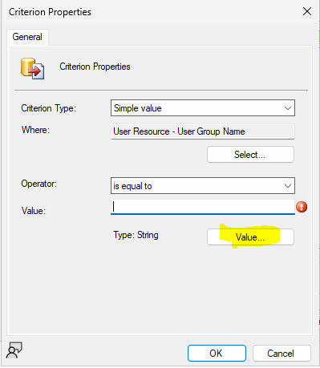

Whoever is the members of the _Domain Admins_ will be added in this collection. Click OK until you reach the _Create User Collection Wizard window_ then click Next

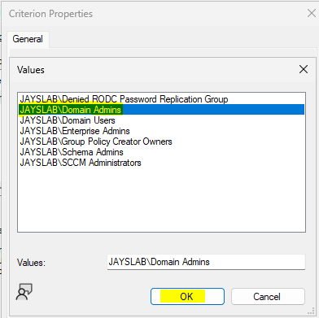
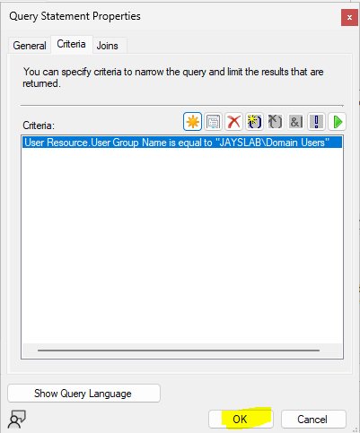
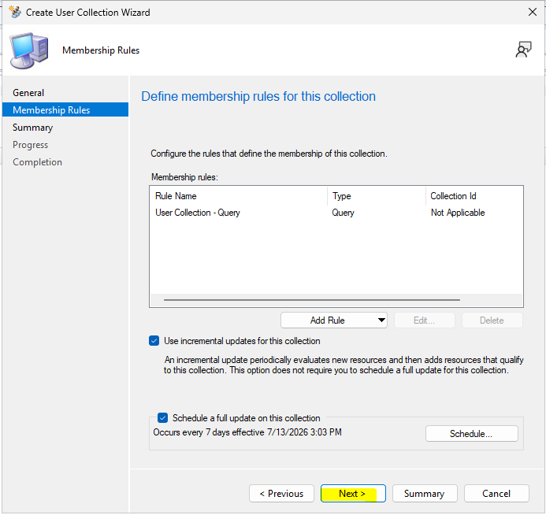
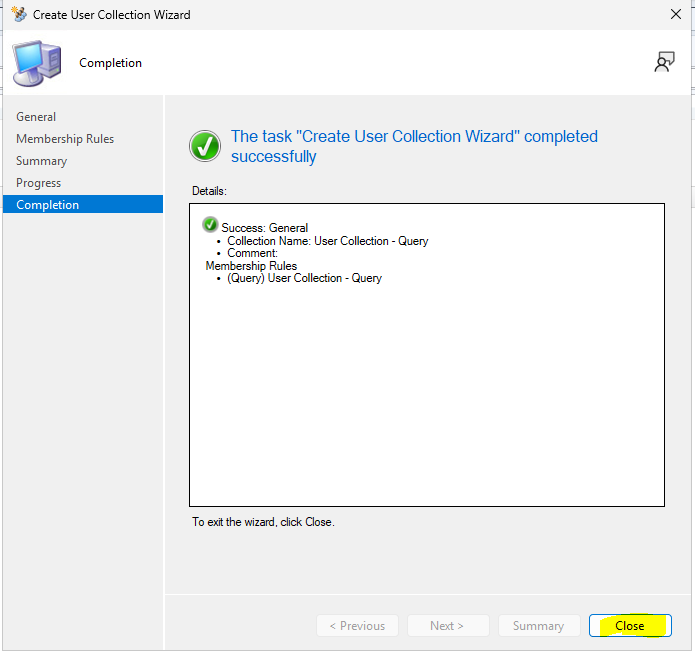

Right click the newly created collection and select Show Members

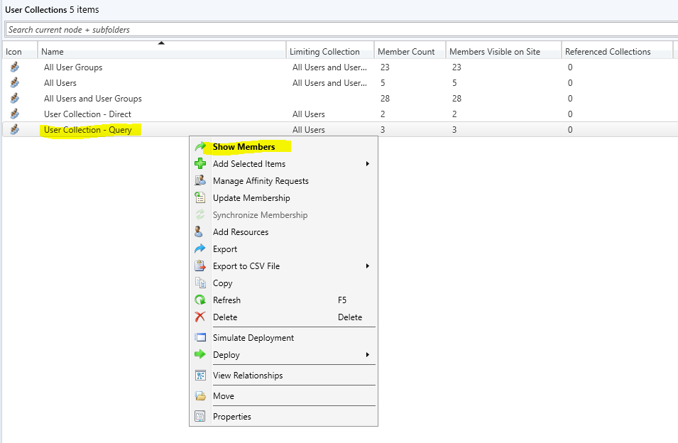

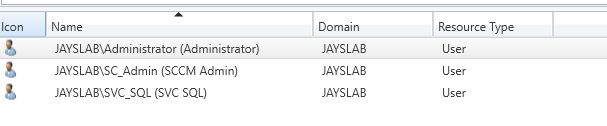
