# Configure Automatic Client Push Installation

The primary benefit of automatic client push installation in Microsoft Configuration Manager (formerly SCCM) is hands-free, automated endpoint onboarding. By integrating with Active Directory System Discovery, it dynamically detects new computers on your network and automatically pushes the client software, eliminating the need for manual deployment

### Configuration

You can see the Client column that we don't have a client at the moment.

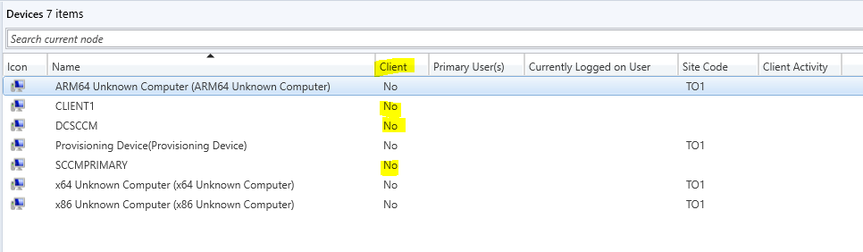

Go to Administration > Site Configuration > Sites

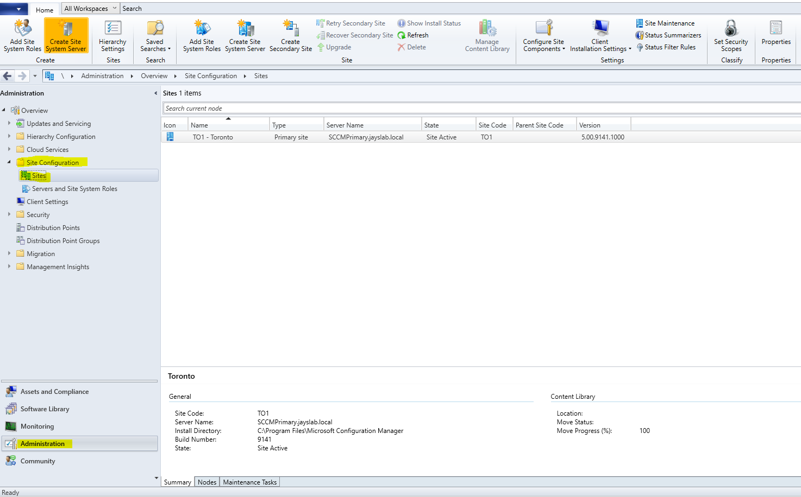

Right click the Site, choose Client Installation Settings > Client Push Installation

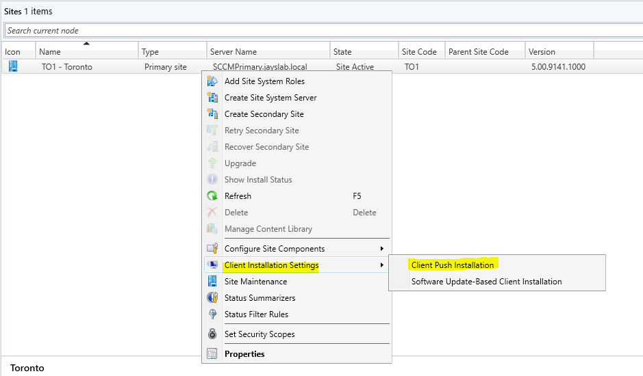

In _Client Push Installation Properties_ window select the following.

- Enable automatic side-wide client push installation
- Configuration Manager site system servers
- Always install the Configuration Manager client on domain controllers

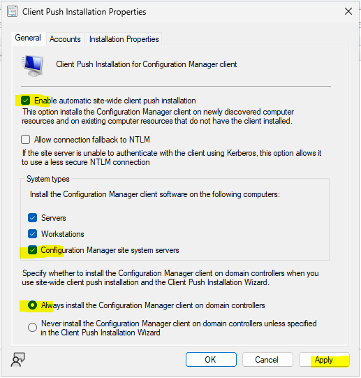

Go to _Accounts Tab_ and add an account with Domain Admin priviledge.

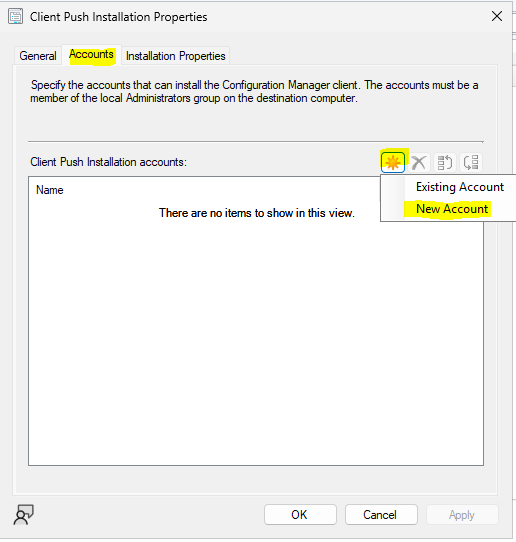

Click Browse then enter the account and enter the password the click Verify

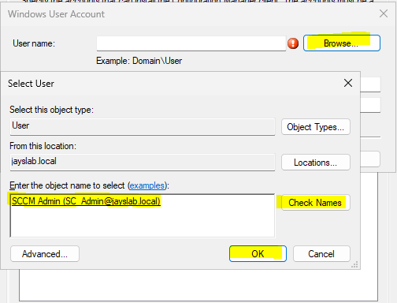

In the Network Share, enter a path where the account has access to verify the connection. Click OK then Apply.

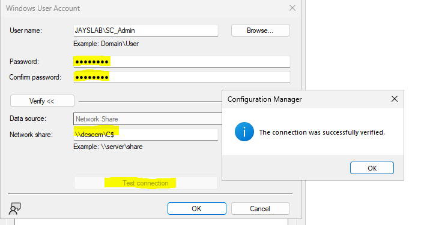

### Push Client to all the Computers

Go to Assets and Compliance > Devices. Select the client you want to include, right click then select _Install Client_

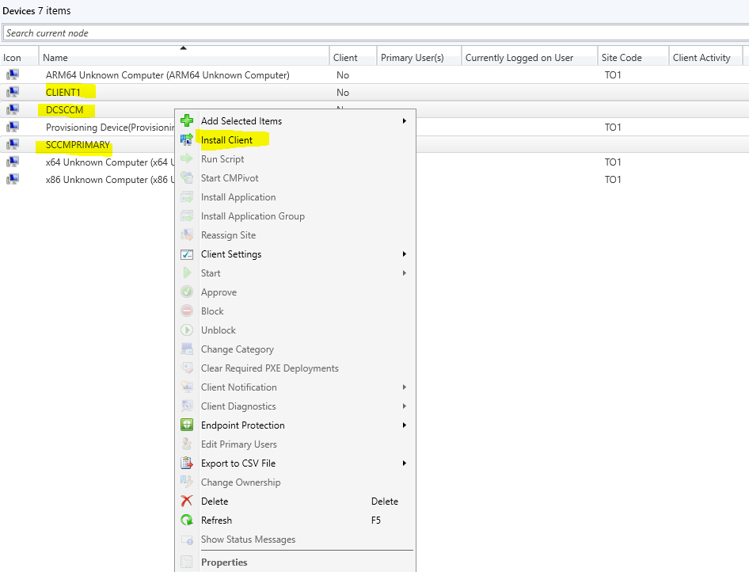

In _Before You Begin_ click Next

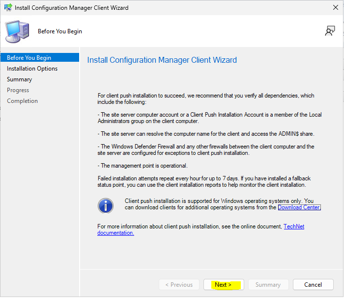

Select Install the client software from a specified site. Click Next then Close

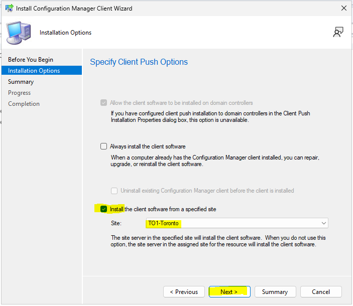

Give it a couple of minutes for the agent to install in computers

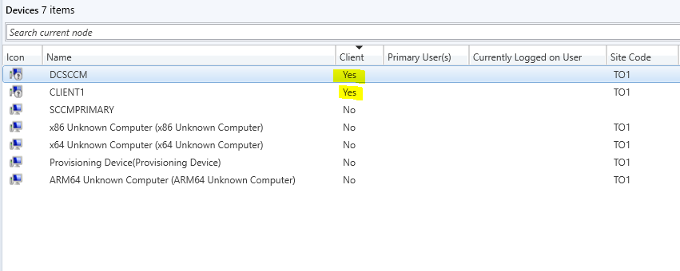
