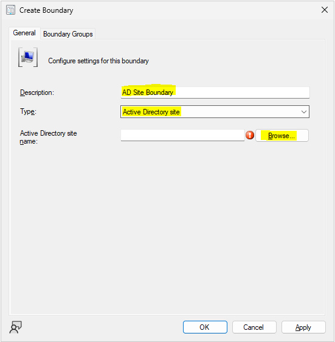
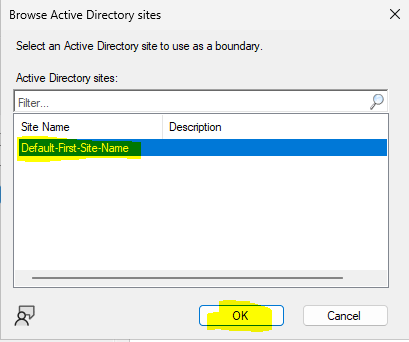
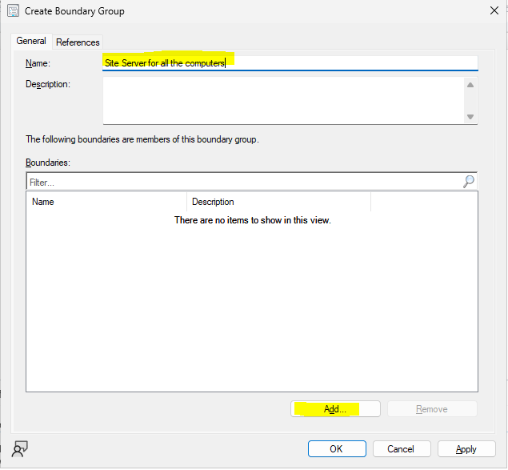
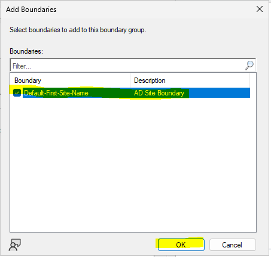
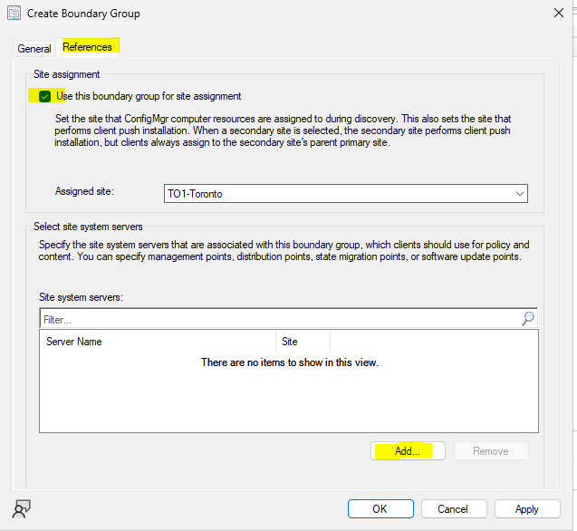
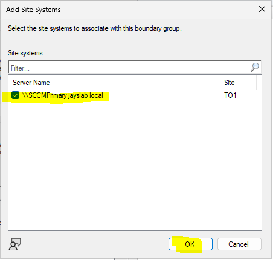
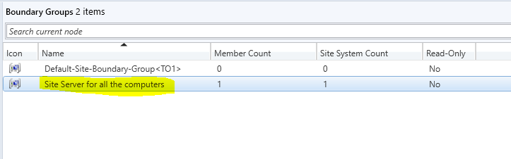

# Creating Boundary and Boundary Groups in MECP Console

### Creating a Boundary

Go to Administration > Hierarchy Configuration > Boundaries. Right click _Boundaries_ and select _Create Boundary_

In the Create Boundary window use the values below:

- **Description**: AD Site Boundary
- **Type**: Active Directory site

In Browse Active Directory sites window choose the _Default-First-Site-Name_ and click OK and Apply

### Creating a Boundary Group

Right click _Boundary Groups_ and select _Create Boundary Group_

Type a _Name_ and click _Add_ button

In _Add Boundaries_ window, select the boundaries we created earlier and click OK

In _Create Boundary Groups_ window, go to _References Tab_ and tick the checkbox in Site Assignment and click Add button

In Add Site System window, select the server and click OK and then Apply

