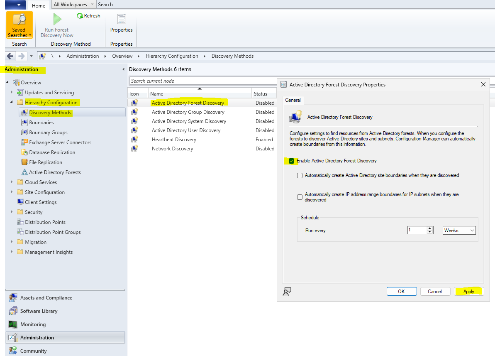
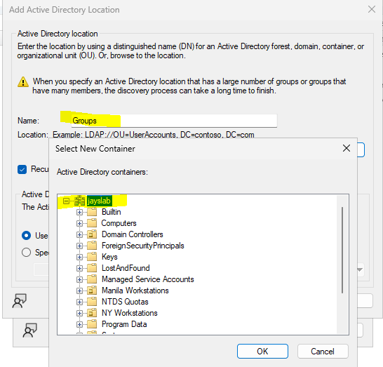
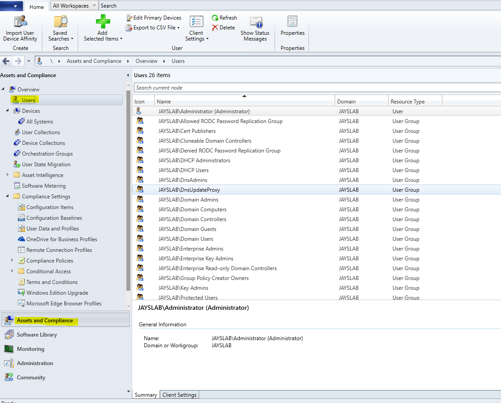
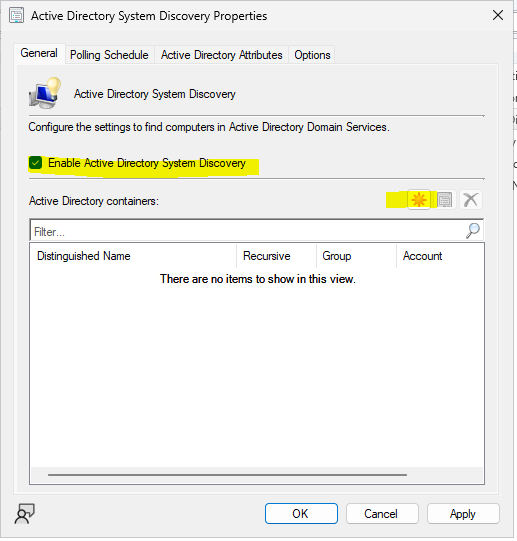
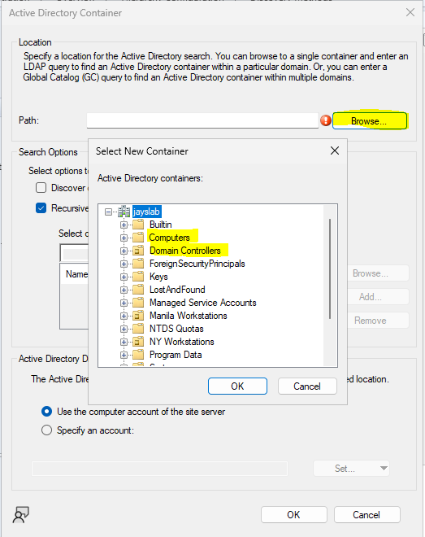
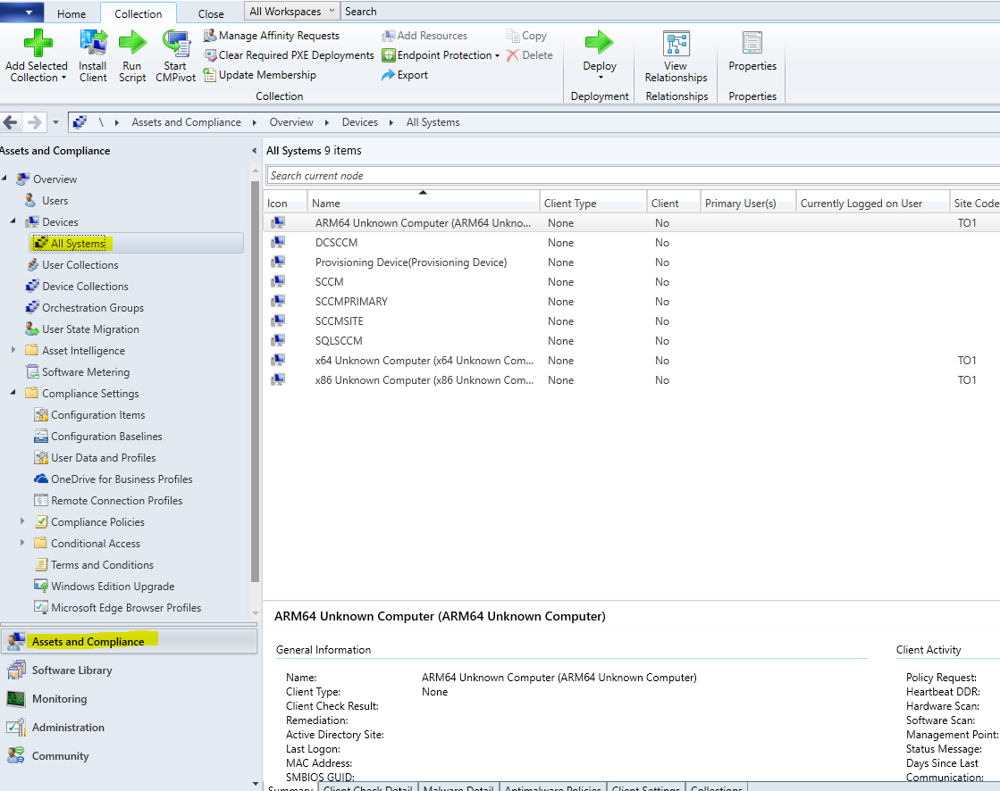
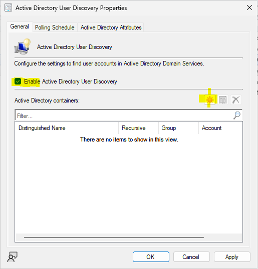
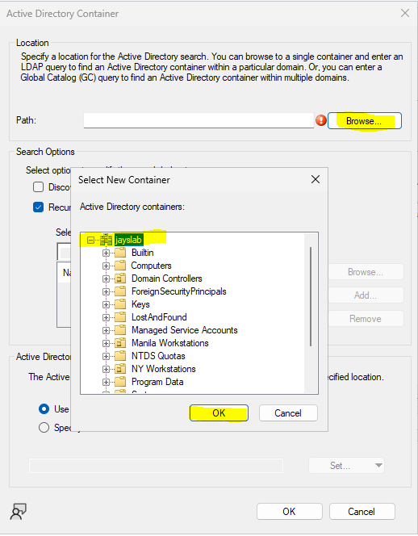

# Discovery of Resrources From Active Directory to MEMP Console

## Summary

### Enable Active Directory Forest

Go to Administration > Hierarchy Configuration > Discovery Methods. Right click *Active Directory Forest Directory* and select Properties

### Enable Active Directory Group Discovery

Go to Administration > Hierarchy Configuration > Discovery Methods. Right click *Active Directory Group Discovery* and select Properties

In the *Add Active Directory Location* window, add Name and click Browse and select *jayslab* and click OK then Apply

Go to Assets and Compliance > Users and check if the Groups are being discovered by MECM

### Enable Active Directory System Discovery

Go to Administration > Hierarchy Configuration > Discovery Methods. Right click *Active Directory System Discovery* and select Properties.

- Enable Active Directory System Discovery
- Click the Yellow icon in Active Directory containers

Select Browse and choose the option *Computers* and click OK. Do the same thing and choose the option *Domain Controllers*. 

Click *Apply* and *OK*

Go to Assets and Compliance > Users and check if the computer systems are being discovered by MECM

### Enable Active Directory User Discovery

Go to Administration > Hierarchy Configuration > Discovery Methods. Right click *Active Directory User Discovery* and select Properties

- Enable Active Directory User Discovery
- Click the Yellow icon in Active Directory containers

Select *Browse* and choose *jayslab* and click OK and Apply

Go to Assets and Compliance > Users and check if the computer systems are being discovered by MECM

