# Manage Client Settings

Control how the Configuration Manager client behaves on managed devices. It allows you to modify the Default Client Settings (applied to all computers in your hierarchy) or create Custom Client Settings that override the defaults for specific device or user collections.

### Create Custom Client Settings

Go to *Administration* > right click *Create Custom Client Device Settings*

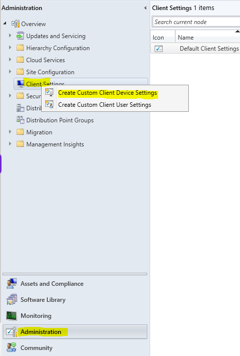

- Client Cache Settings

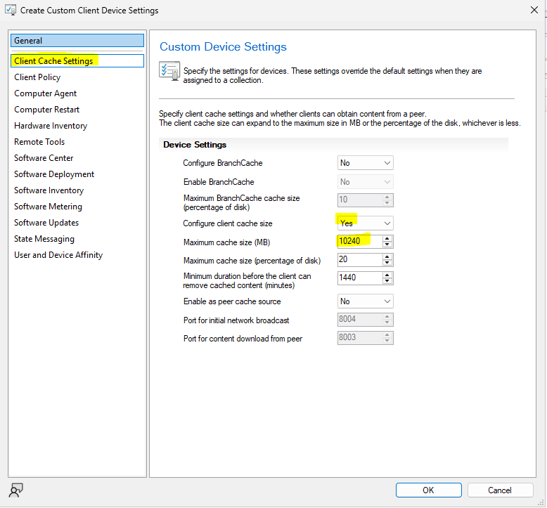

- Client Policy

 Since we have few computers we will change it to a lower polling inverval

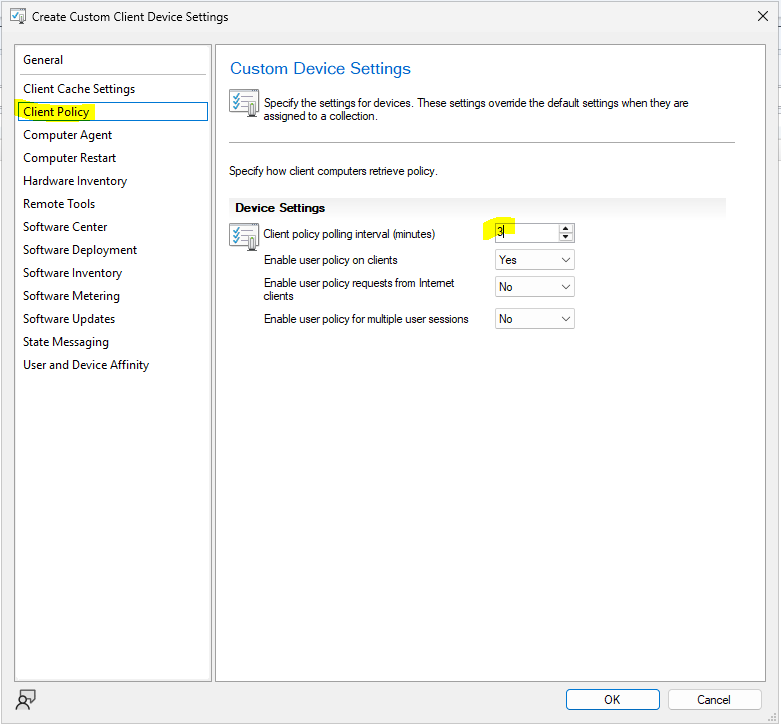

-Computer Agent

Select *Bypass* so it will not look for digital signature and block the execution

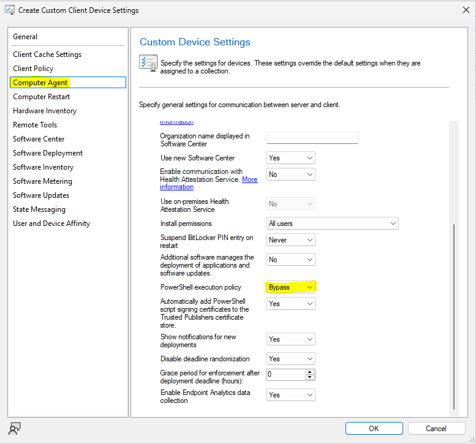

-Computer Restart

We're changing to a lower value for testing purposes

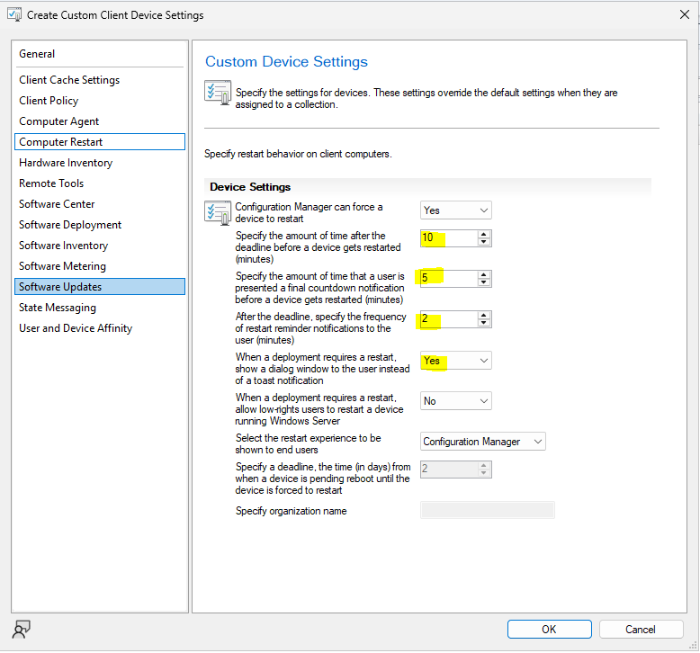

-Hardware Inventory

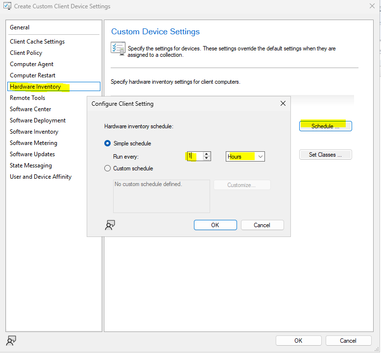
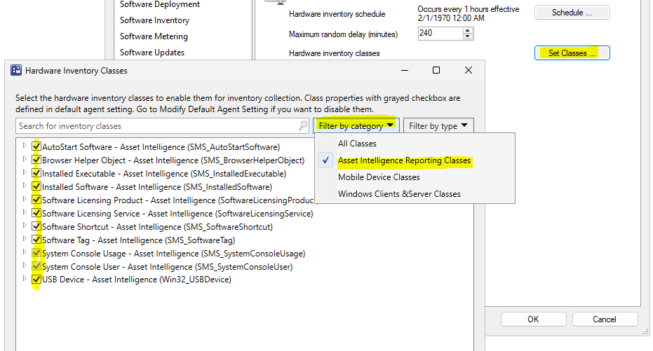

-Remote Tools

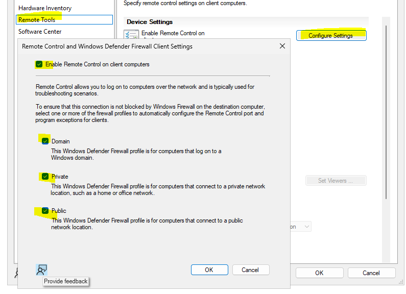

Select the account who has domain admin access

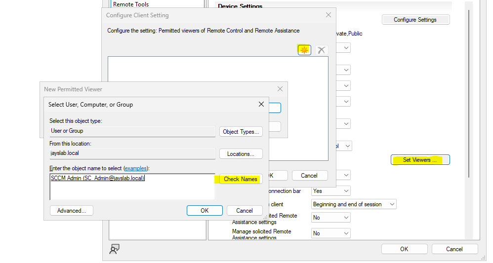

-Software Center

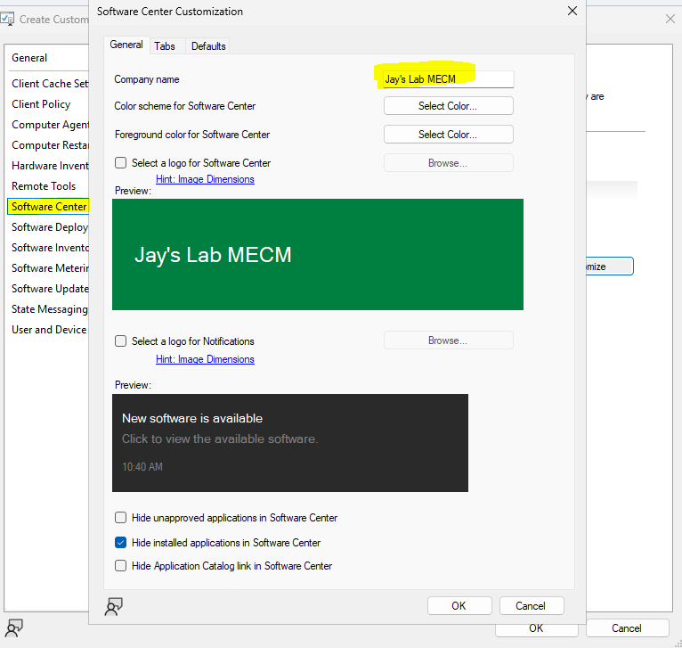

-Software Deployment

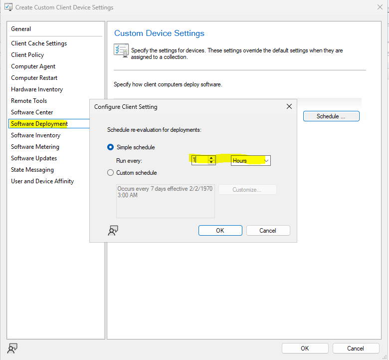

-Software Inventory

Change to *1 Hour* and add .exe, .msi and .xml in *Set Types*

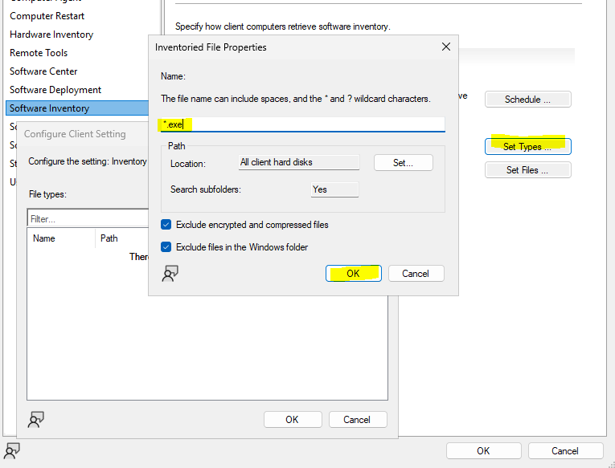

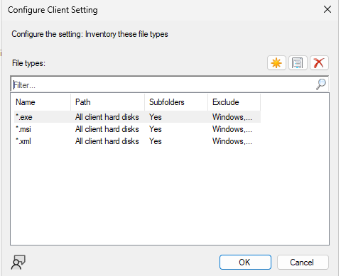

-Software Metering

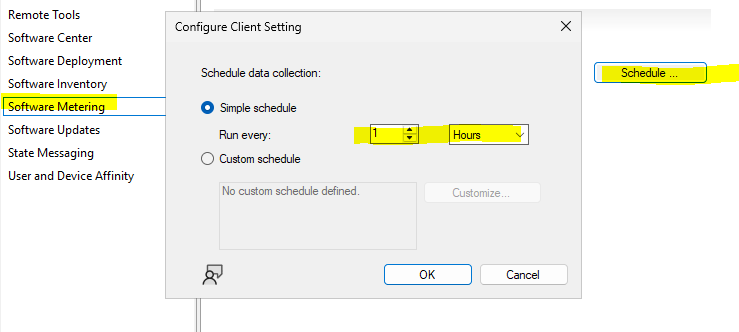

-Software Updates

Sofware update scan schedule: 1 Hour
Schedule deployment re-evaluation: 1 Hour
Enable manamgement of the Office 365 Client Agent: Yes

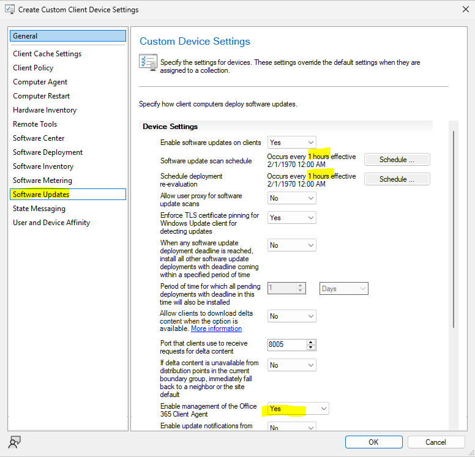

-State Messaging

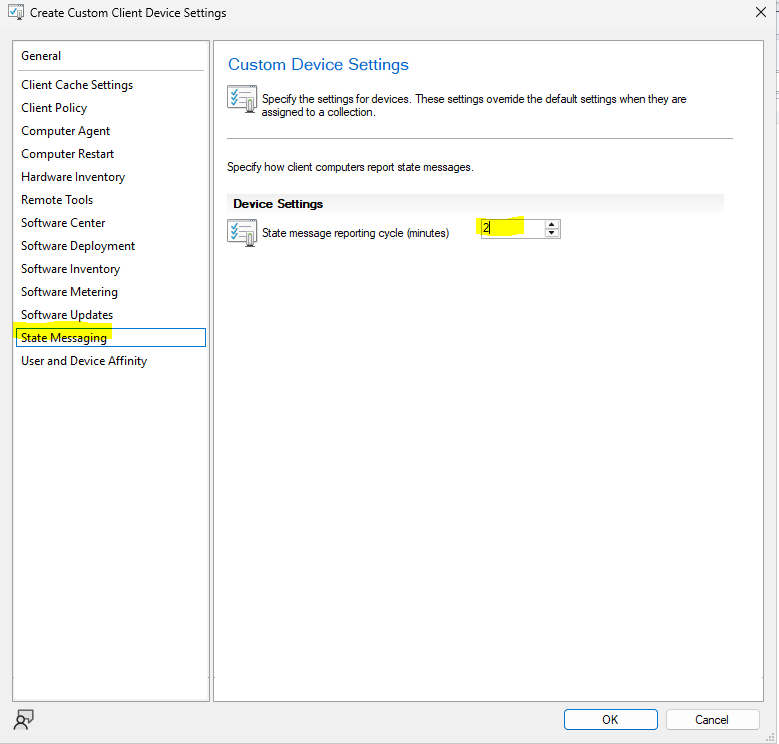

-User and Device Affinity

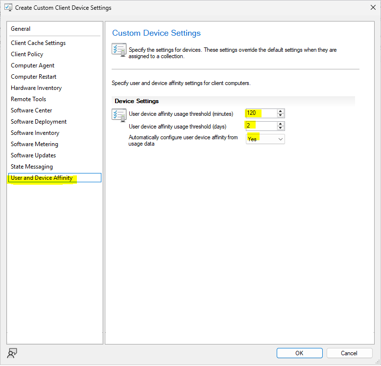

### Deploy to Client Machines

Right click the newly created custom client settings and choose *Deploy*
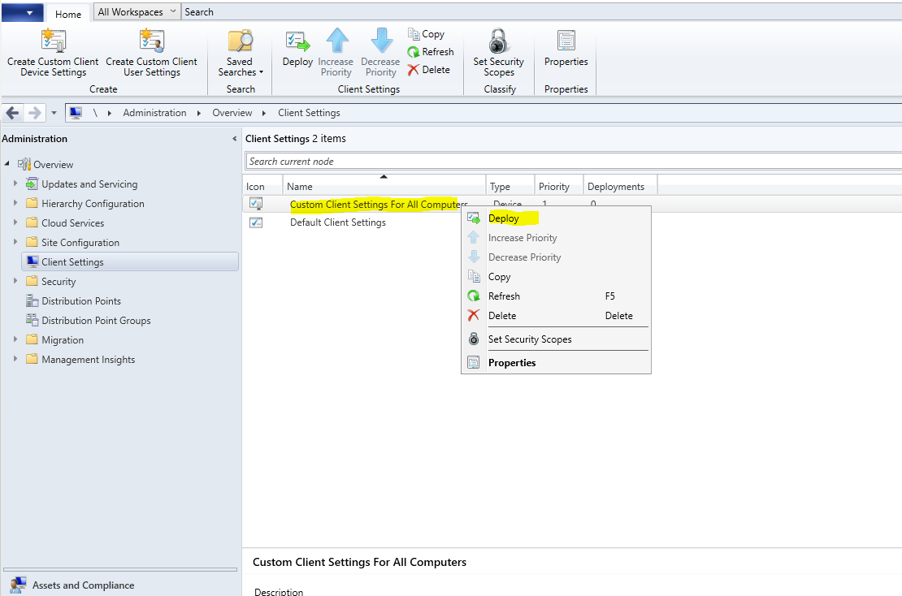

Select *All Desktop and Server Clients*

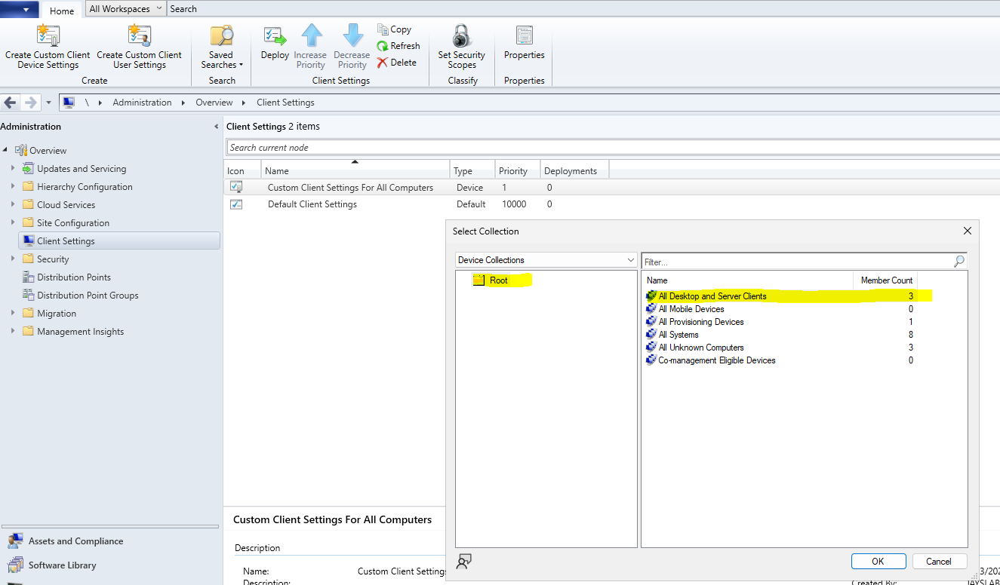
