# Software Update Point Configuration

### Installation

Go to Administration > Site Configuration Servers > Site System Roles. Right click the server and select _Add Site System Role_

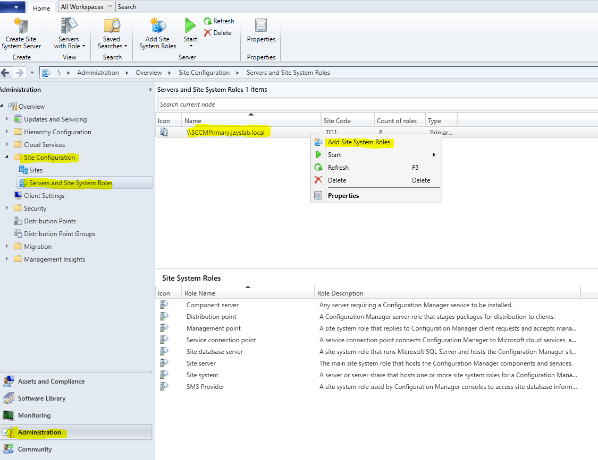

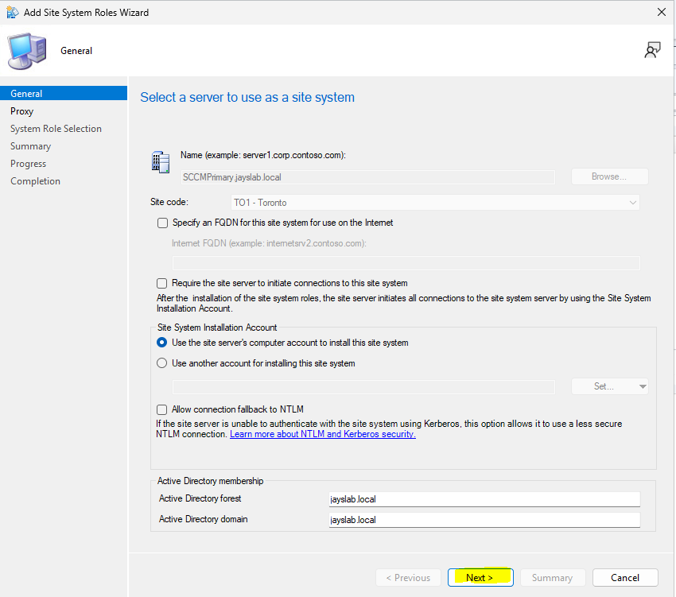

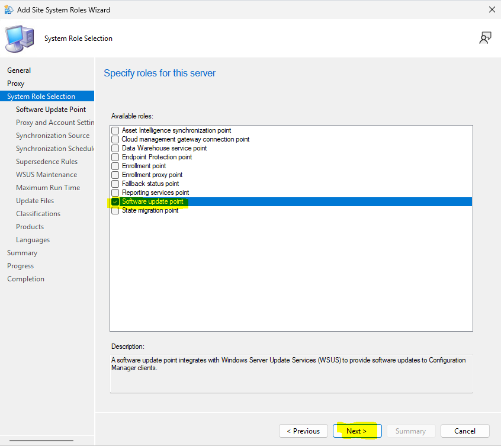

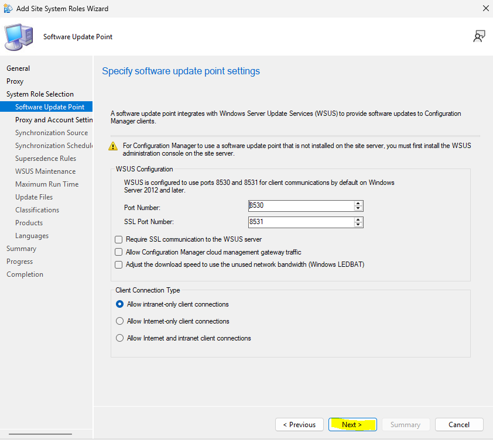

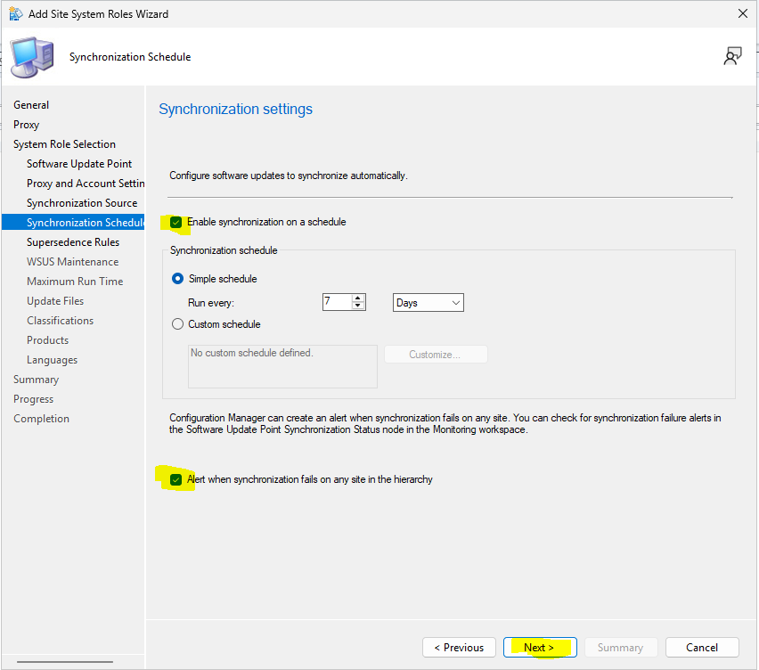

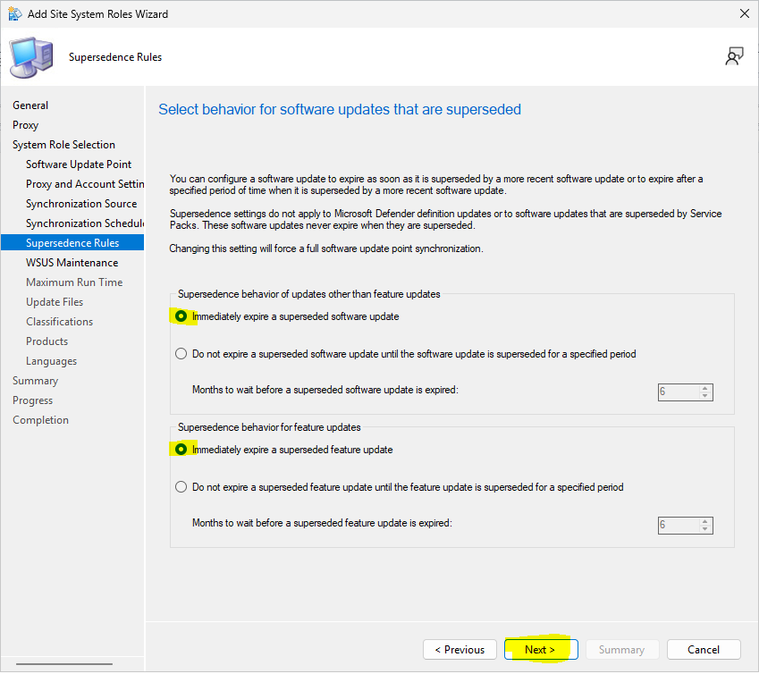

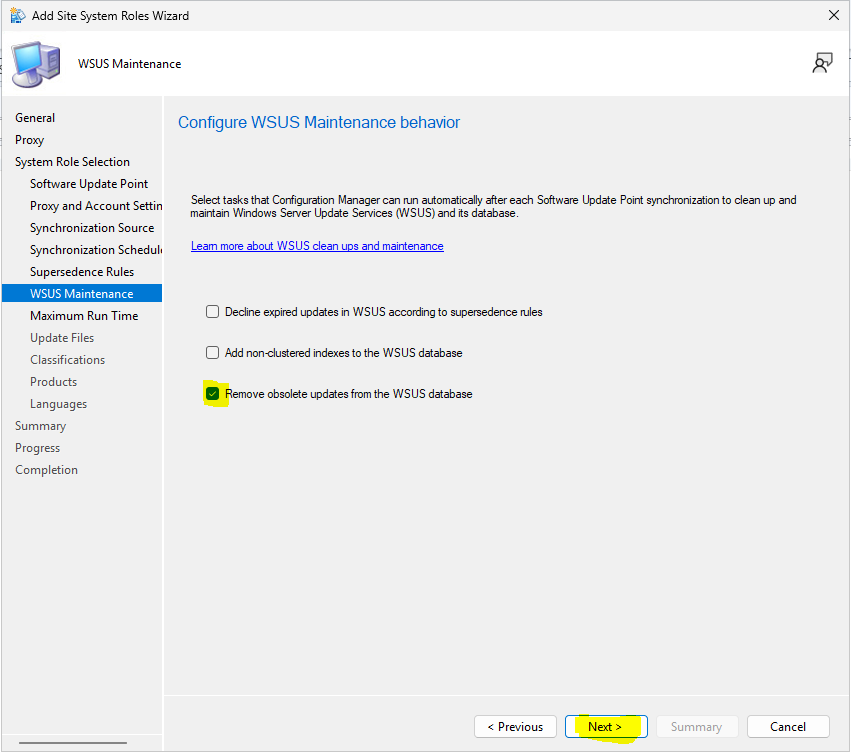

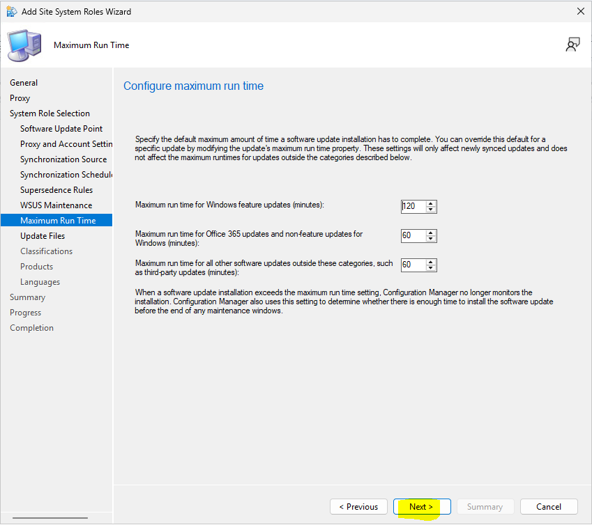

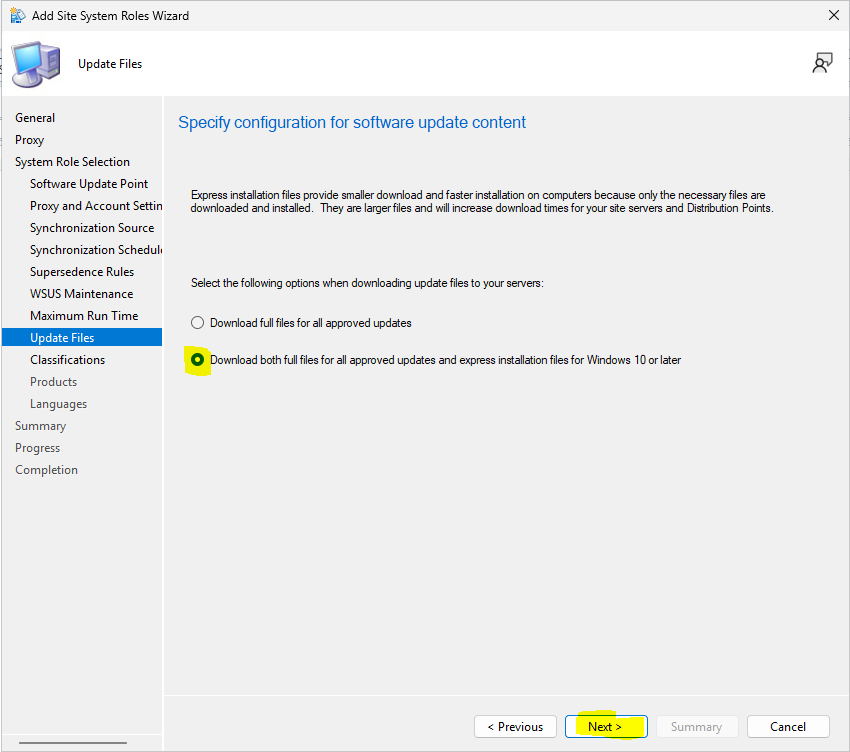

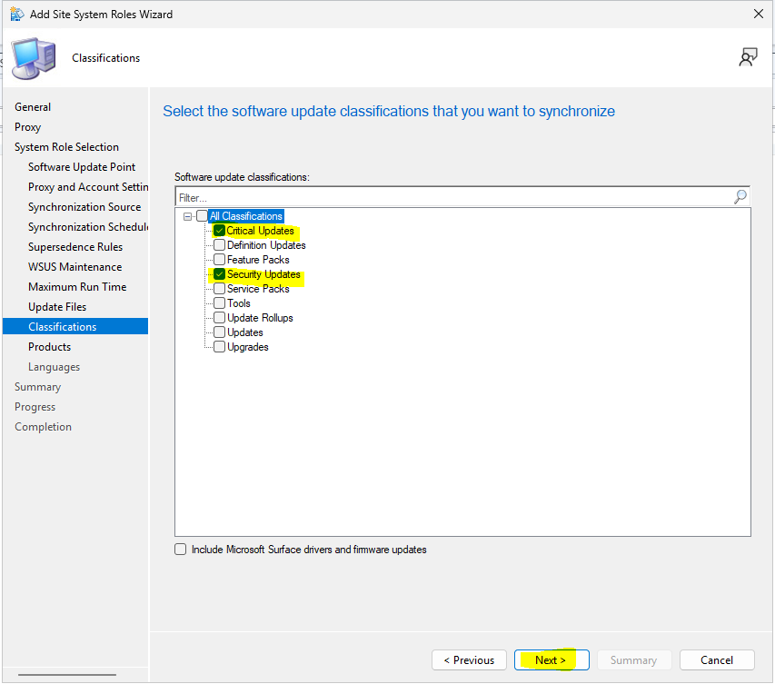

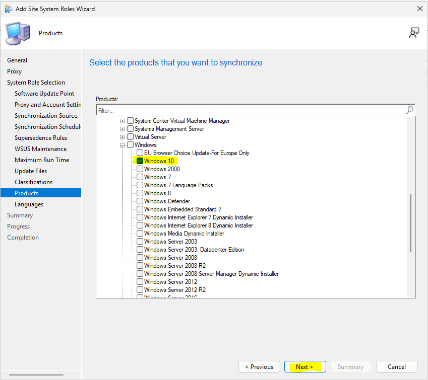

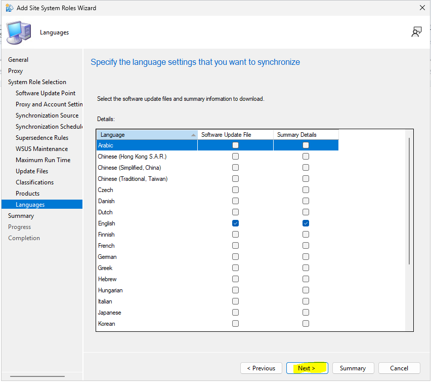

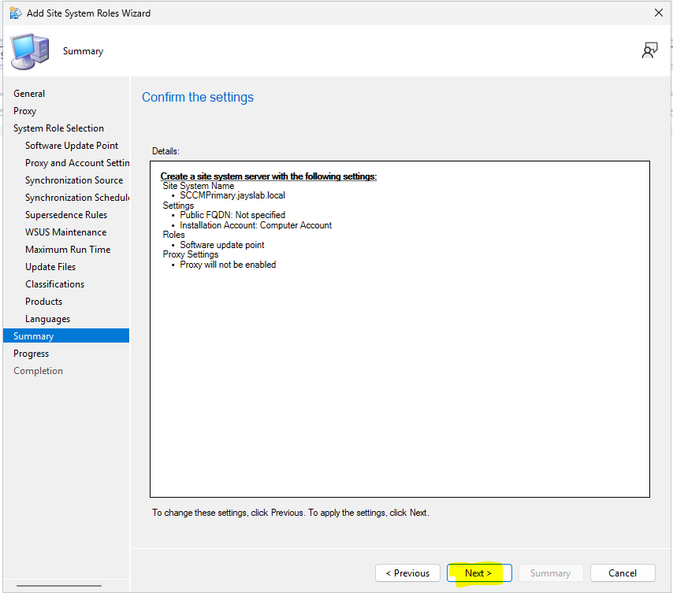

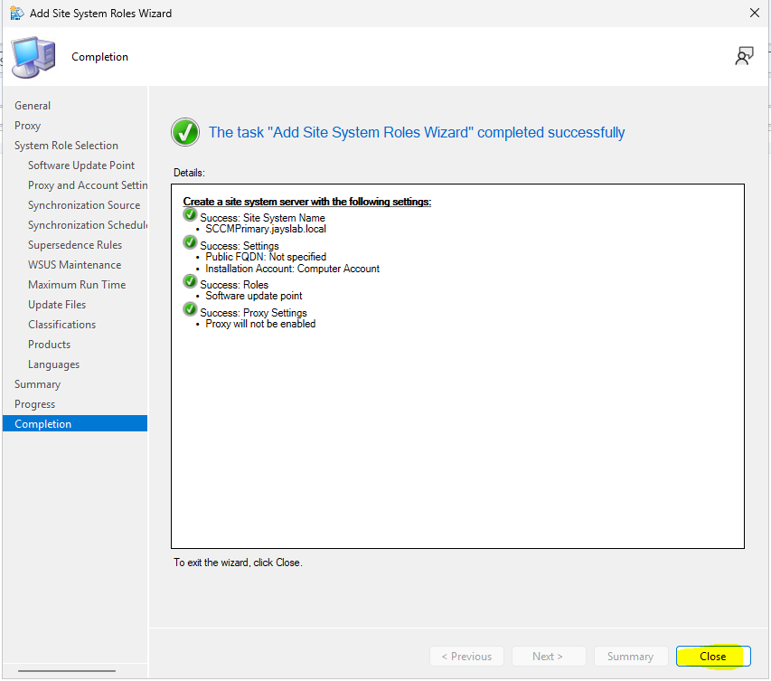

