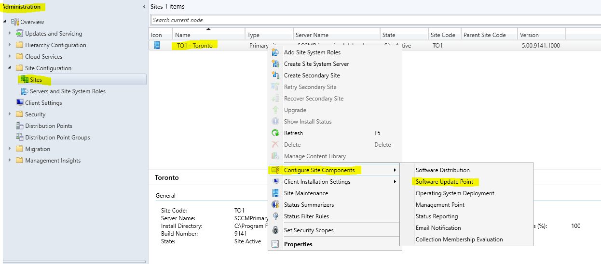
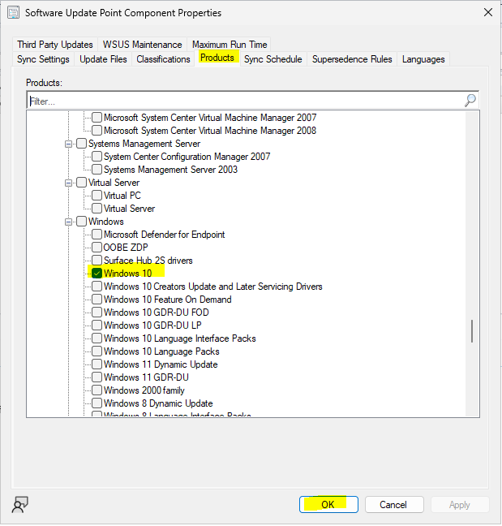
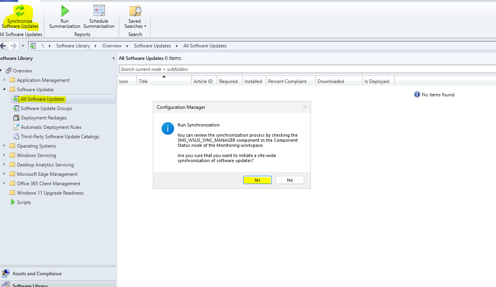
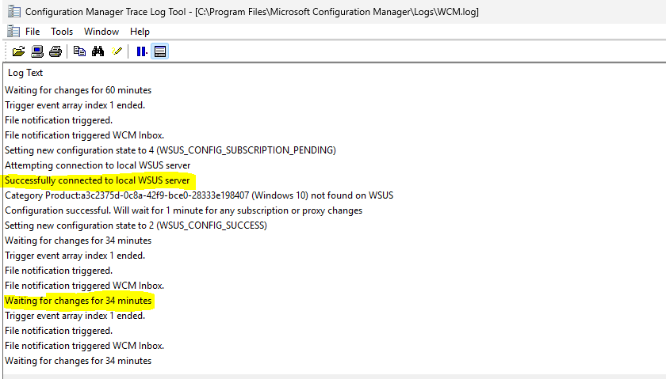
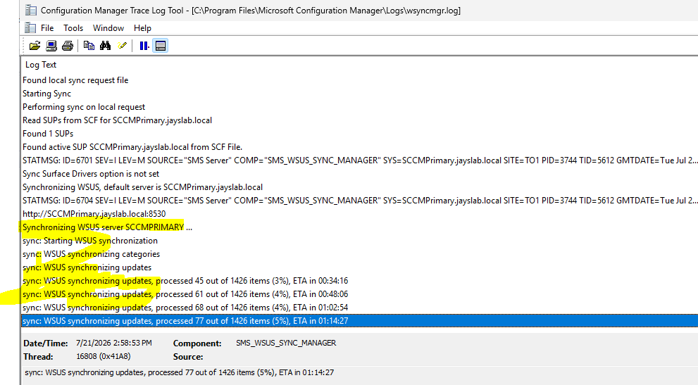
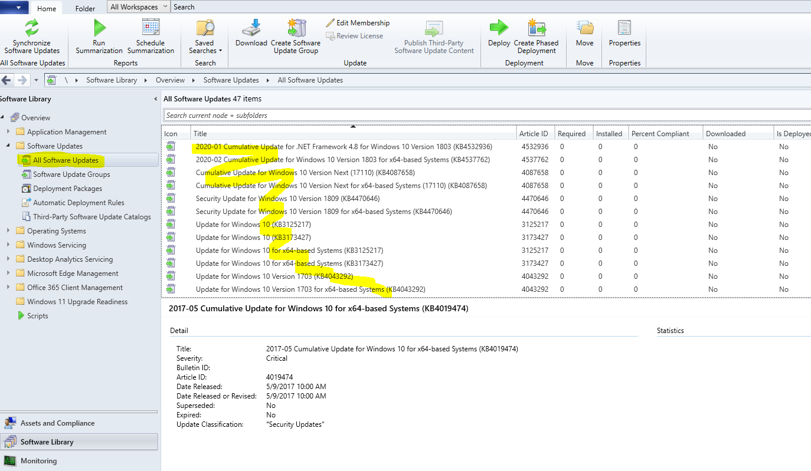

# Software Update Configuration and Deployment

### Selecting a Product for Software Updates

Go to **Administration** > **Sites** > right click **Configure Site Components** > **Software Update Point**

Go to _Products Tab_ and select _Windows 10_

Go to **Software Libary** > **All Software Updates** > **Synchronize Software Updates**

### Check the Log Files for the status

Go to C:\Program Files\Microsoft Configuration Manager Logs

- **WCM.log** : used for troubleshooting Software Update Point (SUP) issues

- **wsyncmgr.log** (WSUS Synchronization Manager log): the primary server-side log for tracking the synchronization process of software updates

