# Group Policy Management

## Summary

Group Policy enables configuration and settings management of user and computer settings on computers running Windows Server and Windows Client operating systems. In addition to using Group Policy to define configurations for groups of users and client computers, you can also use Group Policy to help manage server computers, by configuring many server-specific operational and security settings

| Policy                 | Description                                                            |
| ---------------------- | ---------------------------------------------------------------------- |
| Password Policy        | Set a password policy to enforce strong passwords and enhance security |
| Restrict Control Panel | Set restriction to Organizational Unit to access Control Panel         |

**Key Objectives:**

- Create Group Policy Objects
- Apply Group Policy settings to Organizational Unit

**Pre-requisites**

- Domain Controller
- Organizational Units and Users
- Test machines (e.g Windows 10)

**Difference of Computer Configuration and User Configuration**

| Name                   | Description                                                              |
| ---------------------- | ------------------------------------------------------------------------ |
| Computer Configuration | Settings apply to the machine itself during boot-up, affecting all users |
| User Configuration     | Settings apply to specific user accounts at login                        |

## Password GPO

Open Group Policy Management. Go to _Start_ -> under _Windows Administrative Tools_ select _Group Policy Management_

Right click the domain and select _Create a GPO in this domain_ option. Type a descriptive name (e.g _Password Policy_)

Right click the newly created policy and select _Edit_

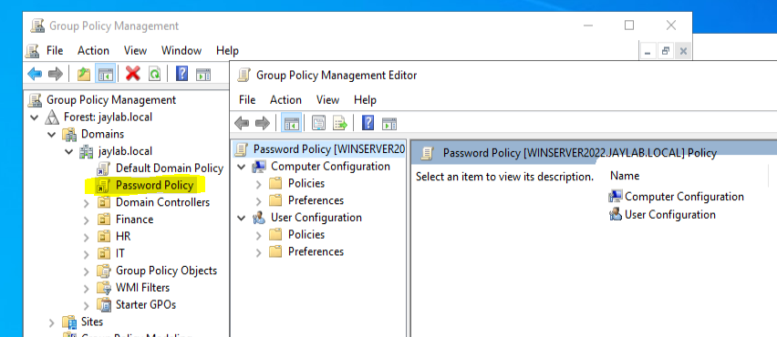

**Difference of Policies and Preferences**

| Name        | Description                                                                               |
| ----------- | ----------------------------------------------------------------------------------------- |
| Policies    | Mandatory, locked-down settings that users cannot change                                  |
| Preferences | "Best-effort" configurations that provide default settings but allow users to modify them |

Under _Computer Configuration_, expand the _Policies_ -> _Windows Settings_ -> _Security Settings_ -> _Account Policies_ and select _Password Policy_

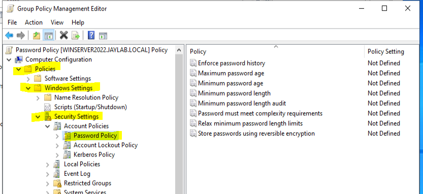

On the right section of the Group Policy Management Editor window, double click _Minimum password length_ and apply the settings below:

- Select _Define policy settings_ checkbox
- Type _12_ characters
- Select _Apply_ and _OK_

You can read the _Explain Tab_ for more details about this security setting

Explore the other password policy settings. I configure the below settings on my home lab.

- Password must meet complexity requirements
- Maximum password age

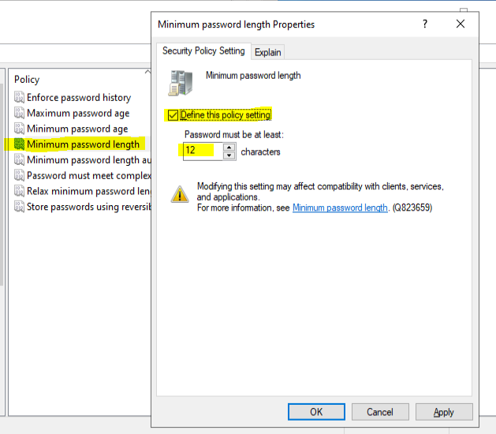
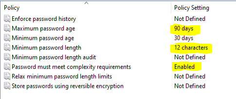

## Wallpaper GPO

Create a Desktop Wallpaper GPO. Same steps when you create the Password Policy GPO.

**Note:** Use UNC Paths: Ensure the GPO points to a UNC path (e.g., \\Server\Share\wallpaper.jpg), not a local path (e.g., C:\wallpaper.jpg) so users can read the image file from its network location. For this tutorial I will use a local path.

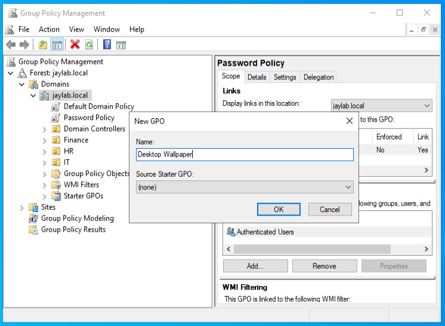

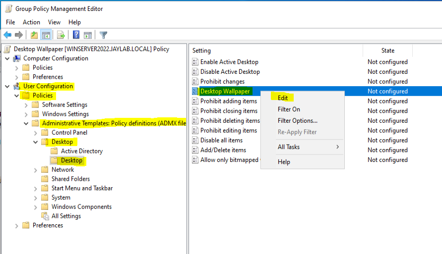

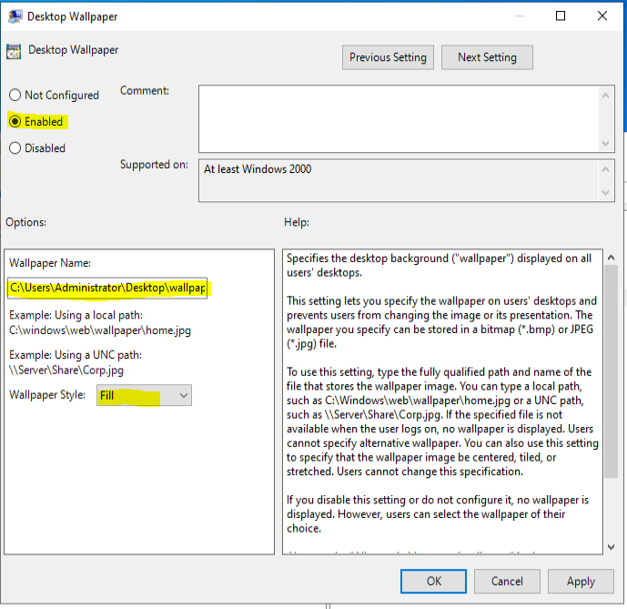

## Control Panel GPO

Create a _Restrict Control Panel_ GPO and _Enable_ it.

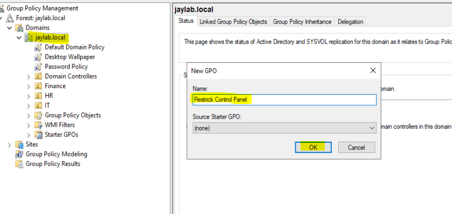
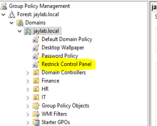

Under _User Configuration_, expand the _Policies_ -> _Administrative Templates Policy_ -> _Security Settings_ -> _Account Policies_ and select _Password Policy_

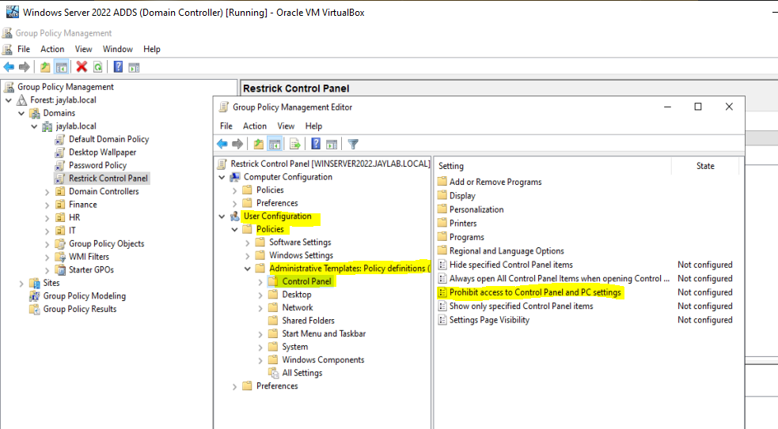
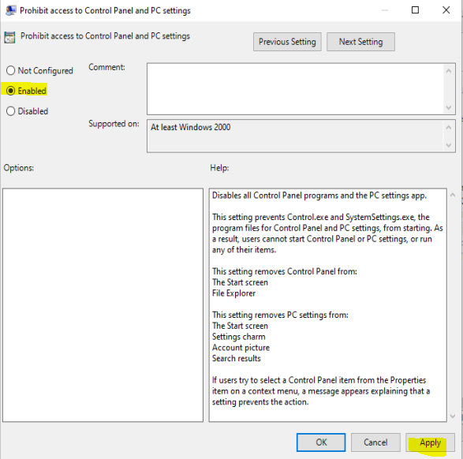

## Applying the GPO to Organizational Unit

Open Group Policy Management, expand your domain and go to Group Policy Object. Select a GPO and drag and drop to the Organizational Unit you want to implement it with. In this example I will select the _Restrict Control Panel_ and apply to **Finance** Organizational Unit

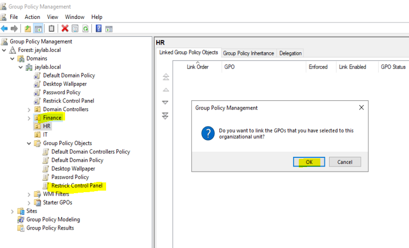
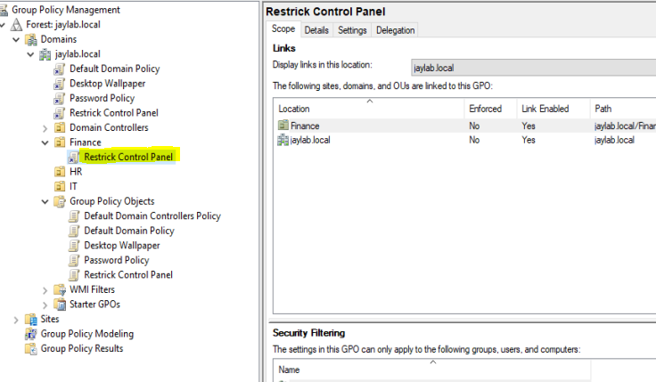

## Testing the Group Policy Object

**Note:** Group Policy changes typically take effect within 90 to 120 minutes (90 minutes plus a random 0–30 minute offset). However, they apply immediately upon a user logging on or a computer restarting. You can force an instant update by running gpupdate /force in the command prompt.

| Test Users | Organizational Unit |
| ---------- | ------------------- |
| lflan      | Finance             |

- Test on _lflan_ user

  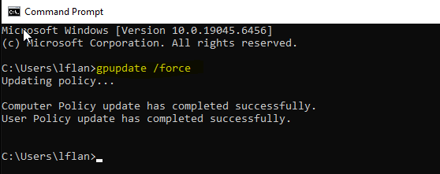

  Search for _Control Panel_ in the search box

  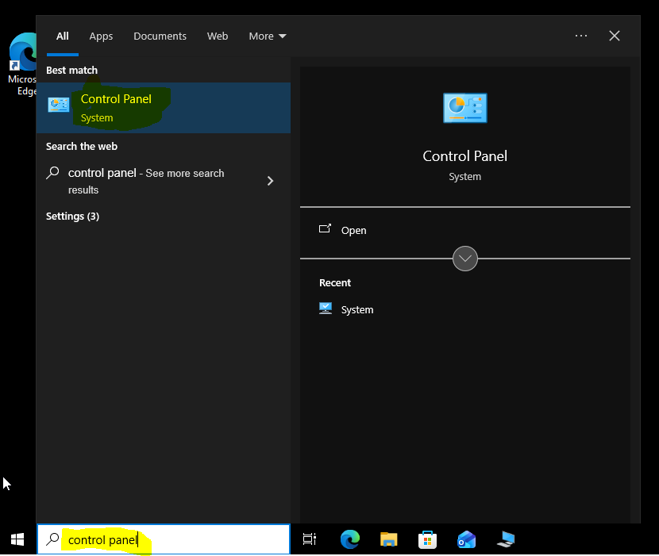

  You will receive the error below after selecting the Control Panel in the search box which indicates that our GPO has been applied.

  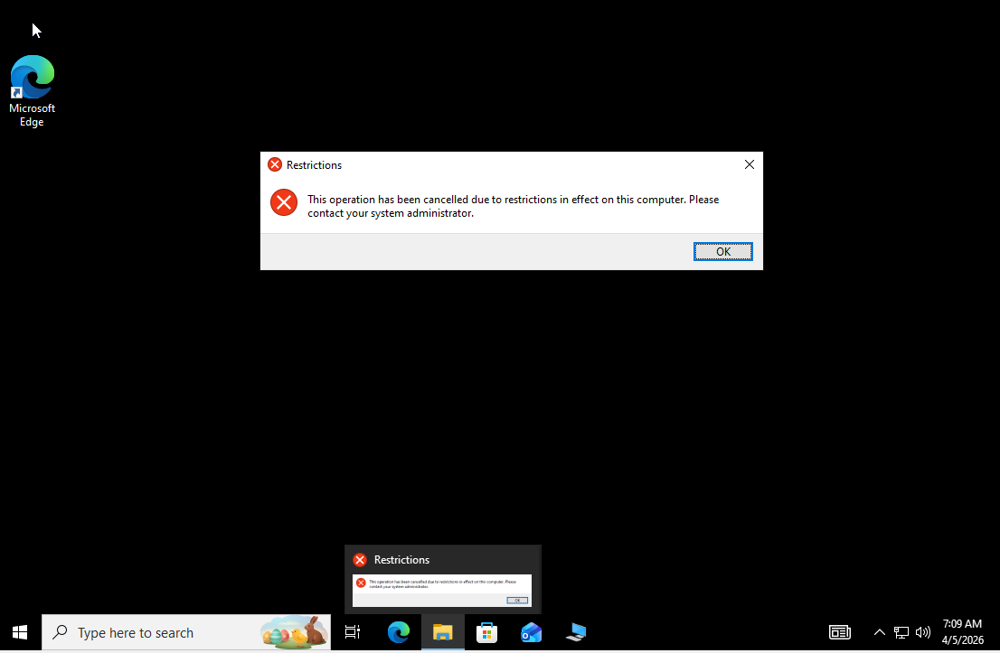
