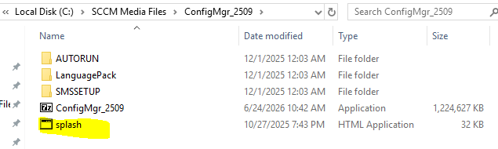
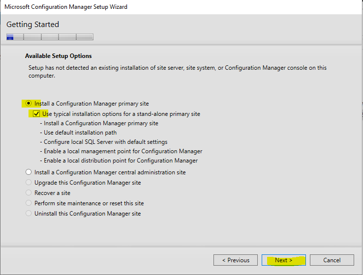
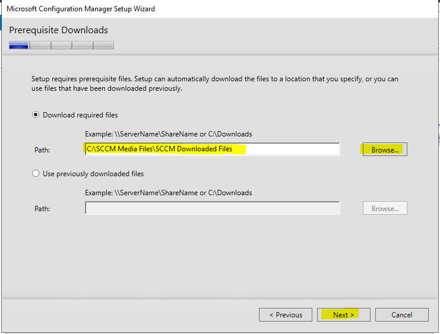
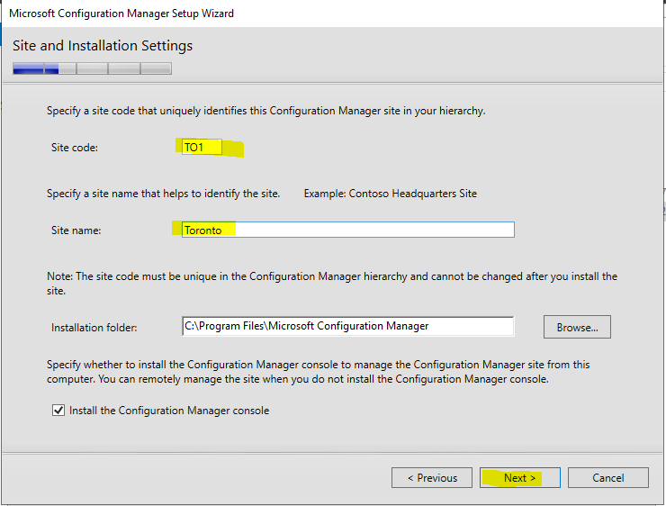
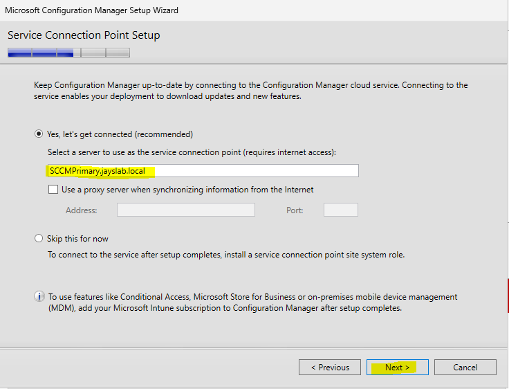
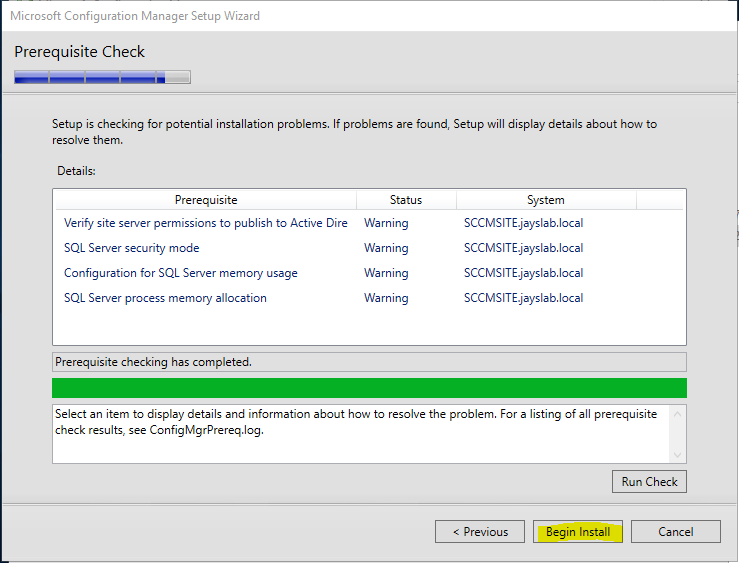
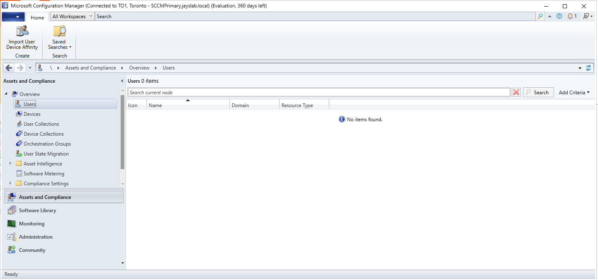

# Microsoft Configuration Manager (SCCM) Installation Guide

## Summary

The primary goal of this repository is to provide a step-by-step guide for building a functional ConfigMgr lab. Future tutorials will build upon this environment to cover real-world systems administration and endpoint management tasks.

## Pre-requisites

- MSSQL Server installation
- Active Directory Domain Service with Domain Accounts
- .Net Framework / ADK
- Download System Center Configuration Manager 2509

## Server Details

| Server            | IP Address   | Service Account |
| ----------------- | ------------ | --------------- |
| Domain Controller | 192.168.1.10 |                 |
| SCCMPrimary       | 192.168.1.15 | SC_Admin        |

### Configuration Manager (SSCM) Installation

Go to SCCM folder and click the _splash_. Select _Install_ then _Next_

Select the _Evaluation edition_ option then accept all the License Agreements.

Select the path for your downloaded files.

Enter _Site code_ and _Site name_. Select _Install the primary site as a stand-alone site_ then click _Next_

Click _Begin Install_

Upon completion of the installation, Open the newly installed _Configuration Management Console_

