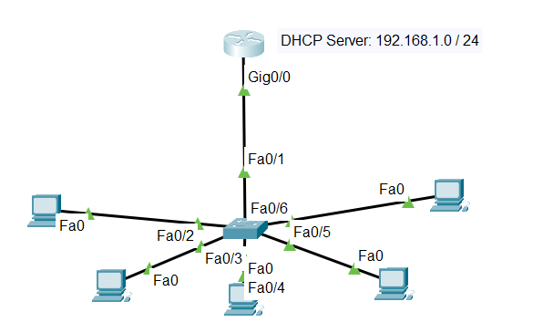
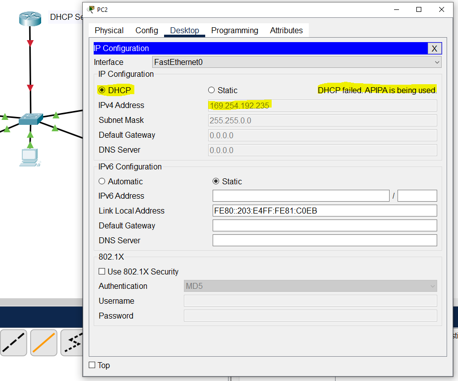
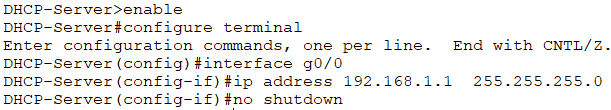
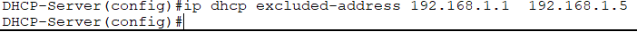
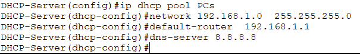
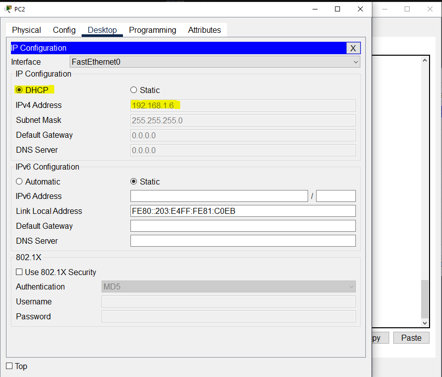

# Set-up DHCP Server

## Summary

This configuration demonstrates a basic DHCP server setup in Cisco Packet Tracer where the router is configured to automatically assign IP addresses to client devices on a single network. The setup uses one DHCP pool named OFFICE-PCS for the 192.168.1.0/24 network. The router interface G0/0 is assigned the gateway address 192.168.1.1, while a range of addresses (192.168.1.1–192.168.1.20) is excluded from dynamic assignment to reserve them for infrastructure devices such as routers, printers, or servers.

This setup focuses only on the basic DHCP pool configuration and functionality. It does not include DHCP security features such as:

* DHCP Snooping
* Port Security
* Dynamic ARP Inspection (DAI)
* VLAN segmentation
* Rogue DHCP prevention

## Diagram

  

## IP Addressing Assignment

| Device | IP Address |
| ---- | ---- |
|Router Interface (G0/0)|192.168.1.1|
|DHCP Range (PCs)|192.168.1.6 - 192.168.1.254|
|Subnet Mask|255.255.255.0|
|DNS Server |8.8.8.8|


This is the initial setup before the configuration of our client devices (PCs), APIPA ip address is being used.



## Configure Router Interface

Select the DHCP Server (Router) and type the below commands

```
enable
configure terminal

interface g0/0
ip address 192.168.1.1  255.255.255.0
no shutdown
```
    
  

## Exclude Reserved IP Addresses

Best practice is to reserve some IPs for *Routers, Printers, Servers and Network Devices*

Go to *global configuration* and type the below command

`ip dhcp excluded-address 192.168.1.1 192.168.1.5`



## Create DHCP Pool

Go to *global configuration* and type the below commands

```
ip dhcp pool PCs
network 192.168.1.0  255.255.255.0
default-router 192.168.1.1
dns-server 8.8.8.8
```



## Configure PCs

On each PC in Packet Tracer:

* Open PC
* Go to Desktop
* Select IP Configuration
* Click DHCP



**Note:** You'll notice when you configure the PCs that the DCHP Server will start giving IP address starting from 192.168.1.6 because we exclude the IP address 192.168.1.1 to 192.168.1.5 for Printers, Servers and other Network Devices.