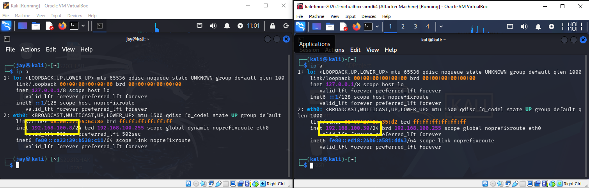
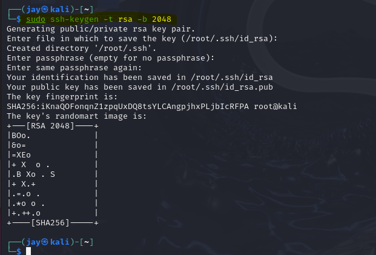
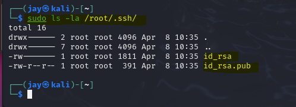
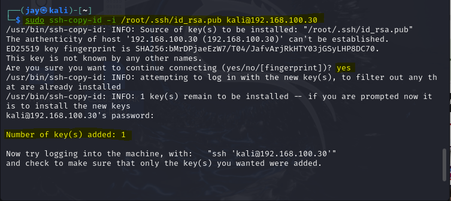
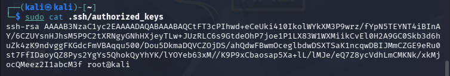
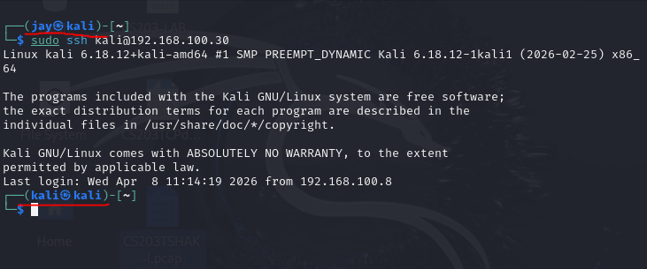

# Set-up Passwordless SSH

## Summary

Learn how set-up passwordless SSH so you can login to a server without prompting for a password on Linux systems. In this example we will use 2 VMs within the same network.

**Pre-requisite(s):**

- SSH is enabled on the machines

## Create Public and Private key

To be able to login without a password to a different server, we will take the content of a public key and put it to another server we want to login to

- Create an SSH key

  `sudo ssh-keygen -t rsa -b 2048`

  | Flag | Description           |
  | ---- | --------------------- |
  | t    | Type of key to create |
  | b    | Number of bits        |

  

  

- Copy the public key's _(id_rsa.pub)_ content to the server you want to login to.

  `sudo ssh-copy-id -i /root/.ssh/id_rsa.pub kali@192.168.100.30`

  | Flag | Description                                    |
  | ---- | ---------------------------------------------- |
  | i    | Use only the key(s) contained in identity_file |

  

  You can check in another server if the public key has been copied.

  `sudo cat .ssh/authorized_keys`

  

## Test the SSH Connection

We should not be prompted to enter the password. Try to check the logged in user, from _jay@kali_ it became _kali@kali_

`sudo ssh kali@192.168.100.30`

